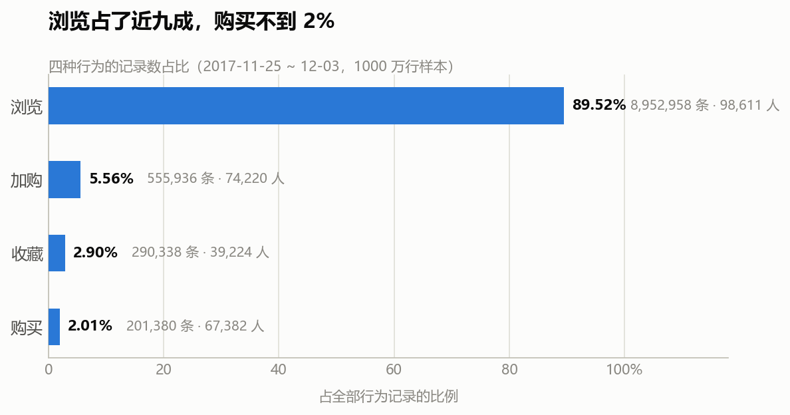
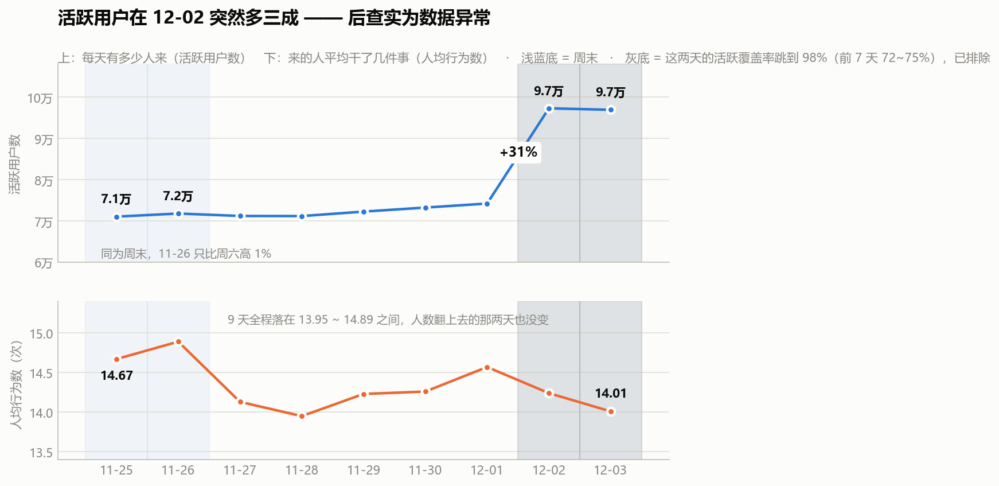

# S1 · 先认识数据：这片数据里，用户到底在干什么

> 对应脚本：`sql/sql_01_overview.sql`　·　对应图：`output/charts/s1_behavior_structure.png`、`s1_daily_trend.png`

---

## 1. 这份数据有多大

一张表，五行字段：谁（user_id）、对什么商品（item_id）、什么类目（category_id）、干了什么（behavior）、什么时候（timestamp）。

```
总行为记录      10,000,612 行
用户数              99,020 人
商品数           1,588,317 个
类目数               8,044 个
覆盖天数                 9 天
```

一句话记住它：**一千万行，十万个人，九天。**

为什么要先钉死这几个数？因为它决定了后面所有结论的**边界**。九天数据只能谈"这一周多的行为结构"，谈不了"用户长期的忠诚度变化"。十万用户是抽样后的规模，做任何绝对量的测算（比如"能多赚多少钱"）之前，先得想清楚能不能从这十万人推到全站——后面 S9 会专门处理这件事。

---

## 2. 四种行为各占多少



| 行为 | 记录数 | 记录占比 | 有多少人做过 | 人数占比 |
|---|---|---|---|---|
| 浏览 pv | 8,952,958 | 89.52% | 98,611 | 99.59% |
| 加购 cart | 555,936 | 5.56% | 74,220 | 74.95% |
| 收藏 fav | 290,338 | 2.90% | 39,224 | 39.61% |
| 购买 buy | 201,380 | 2.01% | 67,382 | 68.05% |

**分两个口径看，是因为这两个口径回答的是不同的问题。**

- **记录数**回答"动作的总量"：浏览 89.5%，购买 2.0%。全站确实是"逛多买少"，这符合直觉。
- **人数**回答"有多少人做过这件事"：这个就有意思了。

### 这里藏着整份数据的第一个坑

看购买那一行：**记录数只占 2.01%，但做过的用户有 67,382 人，占总用户的 68.05%。**

真实电商里，有购买行为的用户比例通常是个位数百分比。68% 这个数字如果拿去面试讲，会被直接问穿。

所以关于这份数据必须说清楚的一句话是：

> **这不是全站流量，而是一批已经被筛过的活跃 / 有购买倾向的用户。**

数据集作者在建库时显然做过过滤。这件事有两个后果：

1. **转化率之类的比率在这份数据里会普遍偏高**，不能拿去和真实业务对标。看到"浏览到加购 75%"这种数不要兴奋，那是筛选的产物。
2. **但行为之间的相对结构仍然可信**——哪一步比哪一步薄、哪个类目比哪个类目难转化、人在什么时段更活跃，这些"谁比谁高"的问题不受筛选的等比影响。

所以本项目的全部结论都有一条纪律：**只讲相对结构，不外推绝对水平。**

### 一句人话结论

浏览是绝对主体（近九成记录），但真正区分用户的是另外三种行为——加购和收藏是两条并列的"有意向"信号，购买是最稀有的动作。

### 面试可以这么说

> "这份数据记录数是 89.5% 的浏览，但按人数看有 68% 的用户产生过购买行为——真实电商这个比例是个位数。所以我判断这份数据集是筛选过的活跃用户集，不是全站流量。因此我全程只讲相对结构，不外推绝对转化率。这个判断我写在了口径文档里，因为它决定了后面每个结论能说到什么程度。"

---

## 3. 九天里，每天有什么不同



| 日期 | 星期 | 活跃用户数 | 人均行为数 |
|---|---|---|---|
| 11-25 | 周六 | 70,991 | 14.67 |
| 11-26 | 周日 | 71,742 | 14.89 |
| 11-27 | 周一 | 71,151 | 14.13 |
| 11-28 | 周二 | 71,127 | 13.95 |
| 11-29 | 周三 | 72,210 | 14.23 |
| 11-30 | 周四 | 73,187 | 14.26 |
| 12-01 | 周五 | 74,158 | 14.57 |
| 12-02 | **周六** | **97,232** | 14.24 |
| 12-03 | **周日** | **96,870** | 14.01 |

### 先说一个我差点写错的结论

一眼看上去，12-02 和 12-03 活跃用户从 7.4 万跳到 9.7 万，涨了三成，而这两天正好是周六周日。很容易顺手写下"周末活跃用户多三成"。

**但这个结论是错的。** 往回看，11-25 和 11-26 也是周六周日，活跃用户是 70,991 和 71,742——周日只比周六高 1.1%，**完全没有抬升**。

所以：

> **这不是"周末效应"。同一个数据里两个周末的表现完全不同，说明抬升来自别的东西。**

我没有理由硬给它安一个原因。数据里没有活动字段、没有渠道字段，任何"这是大促"的说法都是编的。诚实的说法是：**12-02 起出现了一次无法从本数据解释的活跃用户跳涨，最可能对应平台侧的运营活动，但本数据无法证实。**

这件事本身才是值得记的：一个看起来特别顺的解释，只要多问一句"那另一个周末呢"，就塌了。

### 再说一个更硬的发现（这条被 S3 修正过，两种情况都留着）

跳涨的那两天，活跃用户多了 31%，但**人均行为数不升反降**：12-02 是 14.24，12-03 是 14.01，比全周最高的 14.89（11-26）还低。

九天里人均行为数的范围是 **13.95 ~ 14.89**，窄得惊人。

我当时从这里推出一个结论：**多出来的人应该是"新来的"**——因为如果是老用户变活跃，人均行为数应该往上走，而不是平的。

**这个推断是错的。** S3 直接查了一件事："12-02 当天的 9.7 万活跃用户里，有多少是这 9 天里第一次出现的？"答案是 **2 个人**。12-03 是 0 个。

所以跳涨的不是新人。但**也不是"一批老用户回流"**——S4 算留存时发现了一个更根本的问题：

| 日期 | 当日活跃用户 | 当日活跃覆盖率 |
|---|---|---|
| 11-25 ~ 11-30 | 70,991 → 73,187 | 71.7% → 73.9% |
| 12-01 | 74,158 | 74.89% |
| **12-02** | **97,232** | **98.19%** |
| **12-03** | **96,870** | **97.83%** |

**12-02 那天，99,020 个用户里有 97,232 个是活跃的。** 前 7 天稳定在 72~75%，然后一天之内跳到 98.19%。

这不是业务现象。所以 S1 这张图里 12-02/12-03 的那个"跳涨"，**最终判定为数据问题**，详细过程见 `03_时间规律.md` 和 `04_日活留存.md`。本项目的后续分析一律把这两天排除出观察窗。

> **这次纠错值得单独记一笔。**
>
> 我用"人均行为数不涨"推出"来的是新人"，逻辑听着顺，其实跳了一步——**人均行为数不涨，同样兼容"回来的老用户行为量正常"这个解释**，两种情况下这个指标都是平的，它区分不了。
>
> 用间接指标做推断，就得准备好被直接指标打脸。S3 那个查询只花了几秒钟就推翻了这一条。
>
> 正确的做法是：**能用直接指标就别用间接指标**。"这些人是不是新面孔"是可以直接查的（比首次出现日期），根本不需要绕道人均行为数。
>
> 而这还没完——**推翻之后得到的那个"老用户回流"答案，本身也是错的**，只是错得没那么明显。真正把它揪出来的是 S4：一个不可能的数字（留存率反弹）把问题暴露了。所以这一条我改了两轮才写对。

### 一句人话结论

九天里人均行为数几乎纹丝不动（13.95~14.89），活跃用户数却在一个周末跳了三成——**来的人变多了，但每个人做的事没变多**。至于这多出来的人是谁，S1 看不出来；S3 和 S4 查下去才发现，**这两天是数据异常（活跃覆盖率断崖跳到 98%），不是业务现象**。

### 面试可以这么说

> "我原本以为 12-02 那个 31% 的跳涨是周末效应，后来发现 11-25、11-26 同样是周末却完全没涨，把这个解释推翻了。
>
> 然后我又犯了一次错：看到跳涨那两天人均行为数不升反降，我推出来的人应该是'新用户'——因为老用户变活跃的话人均该涨。后来直接去查'当天的活跃用户里有多少是首次出现'，答案是 2 个人。所以是老人回来了，不是拉新。
>
> **但这也还没完。** 我在做留存分析时算出一个不可能的数——某个队列第 7 天的回访率 98.5%，比第 1 天的 78.8% 还高，留存不可能反弹。顺着这个错数查下去，才发现 12-02 当天全体 9.9 万用户里有 9.7 万活跃，覆盖率 98.2%，而前 7 天只有 72~75%。这是数据问题，不是业务现象。最后我把这两天剔除了。
>
> 同一个结论我改了三轮才写对。教训是：**算出来'物理上不该存在'的数字，永远停下来查**——比率超 100%、留存反弹、覆盖率断崖，都是数据在报警。"

---

## 4. 这一节给后面留下了什么

- **口径纪律**：只讲相对结构，不外推绝对水平 —— 已在 `00_口径与数据说明.md` 记录
- **给 S3 的伏笔**：本节只看"天"。12-02 那次跳涨，S3 已经下钻查清——见 `03_时间规律.md`，结论是**老用户回流，不是拉新，也不像限时活动**（逐小时看是整体等比例抬高，没有突变时点）
- **给 S9 的伏笔**：人均行为数的稳定性意味着"提高人均行为数"不是一个好抓手，机会更可能在"把已有意向的人推向成交"上
