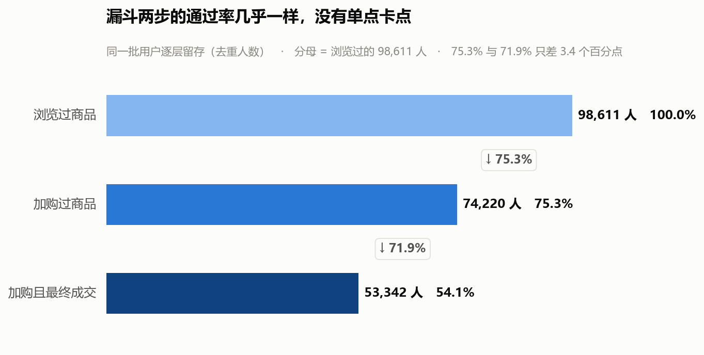
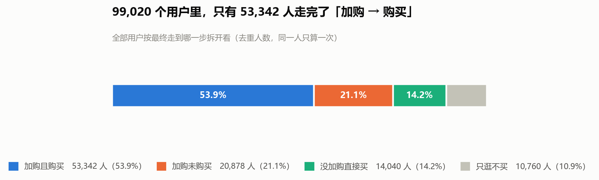
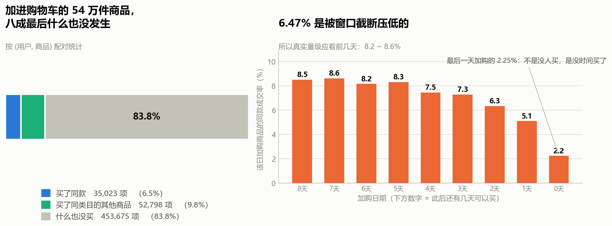

# S2 · 交易漏斗主线：从"逛"到"买"，人到底丢在哪一步

> 对应脚本：`sql/sql_02_funnel.sql`（6 个结果集）
> 对应图：`output/charts/s2_funnel.png`、`s2_user_destination.png`、`s2_cart_item_fate.png`

这是整个项目的核心一节。

---

## ⚠️ 口径更正：本文的数字用的是全窗口，后续各节用的是 7 天窗口

**本文（S2）做的时候，12-02 / 12-03 这两天的异常还没被发现**（那是 S3 才查实的），所以本文所有数字都是 **11-25 ~ 12-03 全窗口**算的。

从 S3 之后，整个项目一律剔除这两天。所以本文的数字和后面各节**对不上，这是两个窗口，不是算错**：

| | 本文（S2） | S3 之后各节 / Tableau 看板 |
|---|---|---|
| 观察窗口 | 11-25 ~ 12-03（9 天） | **11-25 ~ 12-01（7 天）** |
| 加购人数 | 74,220 | **66,542** |
| 买回人数 | 23,107 | 16,896 |
| 买回率 | 31.13% | 25.39% |

**两套数不能互相印证，也不能同时引用。** 对外报数字一律用修正后的这一套（7 天窗口）——修正后的口径才是正确的。

**本文保留原数字不改，是为了留下"发现异常 → 修正口径"这个过程本身**，这比一张干净的最终表更能说明分析是怎么做的。S3 有完整的异常判定依据。

---

## 1. 先说一个我算错的地方

第一版我写的漏斗 SQL，跑出来是这样的：

```
收藏到购买 = 171.79%
```

**转化率超过 100%，这不可能。** 任何一个大于 100% 或者为负的比率，都不是"数据有问题"，而是"我的口径有问题"。查下来是两处错误：

**错误一：把并列关系当成了先后关系。**

收藏和加购不是"先收藏、再收藏的人里有一部分加购"，它们是**两条平行的意向路径**。一个人可能只收藏不加购、只加购不收藏、或者两样都干。把它们串成一条链，分母就错了。

**错误二：分子分母不是同一批人。**

我写的"加购到购买率"是 `购买人数 ÷ 加购人数`。但买的人里有 **14,040 人从没加过购物车**，他们被算进了分子、却不在分母里。分子分母不是同一批人，比率自然虚高。

正确的做法只有一条铁律：

> **漏斗必须严格嵌套——下一层的人，一定是上一层的人的子集。**

所以"加购到购买率"的分子必须是 **既加购过、又购买过** 的人（53,342），不能是全部购买人数（67,382）。

修正后：

```
加购到购买率 = 53,342 ÷ 74,220 = 71.87%   ✅
```

这件事我留在文档里，因为它比结论本身更能说明问题：**比率的合理性检查是最便宜的自检手段**。看到一个不该出现的大于 100% 的数，先怀疑自己，别怀疑数据。

---

## 2. 修正后的漏斗



| 层级 | 人数 | 通过率 |
|---|---|---|
| 浏览过商品 | 98,611 | 100% |
| 加购过商品 | 74,220 | 75.27% |
| 加购且最终成交 | 53,342 | 71.87% |

按全路径算，浏览到购买是 **68.33%**。

### 这里有个必须先说清楚的反常

两步通过率分别是 75.27% 和 71.87%，**只差 3.4 个百分点**。换成绝对人数，第一步丢了 24,391 人，第二步丢了 20,878 人，差 3,513 人。

也就是说：**没有哪一步称得上是"卡点"。**

而且 75% 的浏览到加购率，放在真实电商里是荒谬的——真实电商这一环通常是个位数百分比。

这不能用"淘宝转化好"来解释。它和 S1 里那个 68% 是同一件事的两面：

> **这批用户是被筛过的。他们本来就是"想买的人"，所以哪一步都不怎么漏。**

所以这一节的诚实结论不是"要抓某一步的流失"，而是：

**在这个数据集里，"找漏斗卡点"这个问法本身就不成立。** 标准漏斗模板套在这份数据上，得到的是一个"没有瓶颈"的结果——这本身是有信息量的，它再次印证了数据是被筛选过的。

### ⚠️ 但请把"换问题"这件事说清楚：不是答不上来，是答案没法用

**漏斗分析存在的唯一用途，是回答"资源该往哪一步投"。两步掉得一样狠，这个问题就没有答案**——任何"重点抓加购"的建议都是我硬挑出来的。

而且更根本的是：**不是"漏斗正常"，是"漏斗在这份数据上不成立"。** 拿漏斗去量一群本来就要买的人，就像在医院候诊室里做"谁需要看病"的调查。

**那换成什么，以及为什么换？**

**转折的触发点是一个具体的反常，不是一个含糊的"问不出东西"。** 往下看第 3 节（用户去向）和第 4 节（商品去向）时，出现了三个对不上的数：

| 口径 | 数字 | 问的是 |
|---|---|---|
| 加购过的人，最后买了东西吗 | 71.87% | **人** |
| 加购过的人，买回**自己加购那件**了吗 | 31.13% | **人** |
| 某件被加购的**商品**，被同一人买走了吗 | **6.47%** | **商品** |

**同一批人、同一段时间，从 71.87% 掉到 6.47%。** 这个落差才是要去查的东西，也就是下一节要回答的：

> **既然人没漏、东西却几乎没被买回去——那"加购"这个动作到底标记了什么？**

**注意新老问题的关系：问的是同一个漏斗的同一格，只是往下钻了一层。**

- 老问题问的是**数量**：这批人有没有漏？→ 答：几乎不漏
- 新问题问的是**含义**：既然没漏，那"加购"标记了什么？→ 答：标记意向，不标记"快买了"

**漏斗只告诉你"人从浏览走到了加购"，没告诉你"走到加购意味着什么"。**

---

## 3. 先看全站用户的去向



把 99,020 个用户按"最终走到哪一步"拆开，每个用户只算一次：

| 去向 | 人数 | 占比 |
|---|---|---|
| 加购且购买 | 53,342 | 53.9% |
| 加购未购买 | 20,878 | 21.1% |
| 没加购直接买 | 14,040 | 14.2% |
| 只逛不买 | 10,760 | 10.9% |

> 口径备注：最后一行"只逛不买"是推算出来的（99,020 − 88,260）。这 10,760 人里有 10,351 人确实浏览过，另有 409 个用户连浏览记录都没有（只收藏或只加购）。差异太小，不单独拆。

这张图里有两个值得停下来的地方：

**第一，"没加购直接买"有 14,040 人，占购买者的 20.84%。**

购物车不是购买的必经之路。五个买家里就有一个完全没碰过购物车——直接搜到、看到、买了。这一条直接动摇了"购物车 = 购买意向的唯一载体"这个常识。

**第二，"加购未购买"有 20,878 人。**

这就是运营嘴里常说的"购物车里躺着的人"。名字听起来很诱人——人都把东西放车里了，离成交只差一步，催一下是不是就买了？

S9 会专门针对这批人做召回测算。但在此之前，得先搞清楚**购物车到底是不是"差一步"**。

---

## 4. 深水区：购物车其实不是"待付款清单"

上面所有数字都是**人的口径**——一个用户，算一次。

现在换成**商品的口径**：一件商品被某人加进了购物车，最后这个人买了它吗？

用 (用户, 商品) 配对来算，样本是 541,496 个"某人加购了某件商品"的配对。



结果：

| 结局 | 配对数量 | 占比 |
|---|---|---|
| 买了同款 | 35,023 | **6.47%** |
| 买了同类目的其他商品 | 52,798 | 9.75% |
| 什么也没买 | 453,675 | **83.78%** |

**加进购物车的商品，八成三最后什么也没发生。**

### 这个数一出来，我立刻怀疑自己

6.47% 低得有点过分，最可能的解释是**口径太严**：淘宝上同一款商品换一个颜色、换一个尺码，item_id 就是另一个了。用户加购了红色，买了蓝色，按 item_id 精确匹配就算"没买"。

所以要排掉这个可能。我把口径放宽：**只要这个人买了同类目下的任何东西就算数**——这已经宽松到"加购了红色 T 恤、买了同类目下任何一件衣服都算"。

放宽后是 **16.22%**。是涨了，但**离 6.47% 的那个量级还是同一个数量级**。

> 也就是说：**即便允许用户"买了别的同类东西"，仍然有 83.78% 的加购商品颗粒无收。**

变异体的解释被排除了。这个数是真的。

### 人级和商品级的落差，才是真正要说的

把两个口径并排放：

| | 数字 | 说的是什么 |
|---|---|---|
| 人级：加购到购买率 | **71.87%** | 加购过的人，最终买了东西 |
| 人级：加购者买回率 | **31.13%** | 加购过的人，买回了**自己加购过的**商品 |
| 商品级：同款成交率 | **6.47%** | 某一件被加购的商品，被同一人买走 |

三个数一路走低，讲的是同一件事的不同侧面：

> **加购过的人，71.87% 确实买了东西。但只有 31.13% 的人买的是自己加购的那些。**
>
> 剩下 68.87% 的加购者——大约 51,113 人——买了东西，但**买的不是他放进购物车的东西**。

这就是为什么人级看着漂亮、商品级却很惨。两边都对，只是问的问题不一样。

### 一句人话结论

**购物车不是"待付款清单"，更像"比价清单"或者"意向暂存区"。** 用户把东西放进去，是在收集和比较，不是在排队结账。绝大多数放进车里的东西，最后不会被买回来。

### 这对运营动作意味着什么

如果购物车是"差一步"，那运营动作应该是**针对具体商品催单**（"你购物车里的 XX 降价了，快下手"）。

但 6.47% 说明这个方向是错的——**你催的那件商品，七成以上压根不是他真正想买的。**

正确的方向应该反过来：

1. **不要针对单个商品催**，命中率太低，还会让人反感
2. **要针对"加购过的人"整体运营**——因为这批人本身是高质量人群（71.87% 会买），值得投入
3. **购物车应该被当成"兴趣信号"而不是"意图信号"** ——它说明这个人在逛、在比较，但不说明他要买这一件

---

## 5. 稳健性检验：6.47% 是不是被时间窗口压低了

必须补这一步。

数据只有 9 天。**越晚加购的商品，"之后还有多少时间可以买"越短。** 12-03（最后一天）加购的东西，当天没买就再也没机会了。

如果不管这个，6.47% 就是个被系统性低估的数。

按加购日期拆开看：

| 加购日期 | 此后还有几天可买 | 同款成交率 |
|---|---|---|
| 11-25 | 8 天 | 8.51% |
| 11-26 | 7 天 | 8.63% |
| 11-27 | 6 天 | 8.16% |
| 11-28 | 5 天 | 8.32% |
| 11-29 | 4 天 | 7.45% |
| 11-30 | 3 天 | 7.28% |
| 12-01 | 2 天 | 6.34% |
| 12-02 | 1 天 | 5.11% |
| 12-03 | **0 天** | **2.25%** |

**单调下降，从 8.5% 一路掉到 2.25%。** 这就是窗口截断的确凿证据——最后一天加购的商品不是"没人想买"，是"没时间买了"。

所以：

- **6.47% 是低估的**，它是 9 天窗口下的观测值
- **真实量级应看跟进期充足的前几天：8.2% ~ 8.6%**
- **但结论不变**——即便给足时间，加购商品的自成交率仍然是个位数，远低于人级的 71.87%

**这一步的意义超过数字本身。** 如果不做这个检验，面试官问一句"你这个 6.47% 是不是因为数据只有 9 天"，就只能承认没想过。做了之后，这个软肋变成了加分项：

> "我发现最后一天加购的商品成交率只有 2.25%，明显是窗口截断造成的，所以做了一次按加购日期的拆分。成交率随加购日期单调下降，前四天稳定在 8.2~8.6%。所以我说 6.47% 是低估的，真实值在 8% 出头——但无论取哪个，结论都是'加购商品自成交率是个位数'。"

---

## 6. 这一节的结论

1. **这份数据里没有漏斗卡点。** 两步通过率 75.27% / 71.87%，只差 3.4 个百分点。这不是好消息，而是"数据被筛过"的又一次印证——和 S1 那个 68% 是同一件事。
2. **购物车不是购买必经之路。** 20.84% 的购买者从没加购过。
3. **购物车不是待付款清单。** 加购的商品只有 6.47% 被同一人买回（放宽到同类目也只有 16.22%，排除变异体解释后仍成立）。
4. **人级 71.87% 和商品级 6.47% 的巨大落差，是这一节真正的发现。** 加购过的人确实会买，但买的通常不是他加进车里的东西。
5. **6.47% 是窗口截断后的低估，真实量级在 8% 出头**（按加购日期拆分验证，单调下降是确凿证据）。

## 7. 面试可以这么说

> "我先按标准漏斗做，结果发现两步通过率是 75.3% 和 71.9%，只差 3.4 个百分点——**没有卡点**。放在真实电商里，75% 的浏览到加购率是不合理的，所以我判断这批用户是被筛过的，和'68% 用户有购买行为'是同一个信号。
>
> 于是我把问题换掉了：不问'哪一步漏人'，问'购物车到底意味着什么'。
>
> 结果是人级和商品级出现了巨大落差：加购过的人里 71.87% 最终买了东西，但只有 31.13% 买的是自己加购过的商品；按商品算，被加进购物车的东西只有 6.47% 被同一人买走。我一开始怀疑是 SKU 口径太严——同款换个颜色 item_id 就变了——所以放宽到'买了同类目的任何东西也算'，只涨到 16.22%，量级没变，说明不是口径问题。
>
> 结论是购物车不是待付款清单，是比价清单。所以'针对购物车商品催单'这个常见动作方向是错的，你催的那件东西七成不是他真正想买的。
>
> 最后我补了一个稳健性检验：数据只有 9 天，最后一天加购的商品成交率只有 2.25%，明显是窗口截断。按加购日期拆开后成交率单调下降，前四天稳定在 8.2~8.6%，所以我报告 6.47% 是低估值，真实量级在 8% 出头——但结论不变。"

---

## 8. 局限（面试追问的挡箭牌）

- **没有金额字段。** 全程用人数和商品数算，没法谈 GMV。这也是 S9 要用情景测算而不是直接测算的原因。
- **只有 9 天。** 加购到购买的间隔如果超过 9 天，就观测不到。上面那个检验做了部分修正，但不能完全补上。
- **item_id 无法识别"同款不同 SKU"。** 已用"同类目"口径做了放宽验证，结论不变，但精确的同款成交率无法算出。
- **没有订单号。** "购买"是一类行为记录，一个人一天买多次算多次事件；本节的"购买人数"是去重人数口径，不受影响。
- **数据已确认是筛选过的活跃用户集。** 所有比率只做横向对比（哪个类目/哪群人更高），不往真实业务水平上推。
