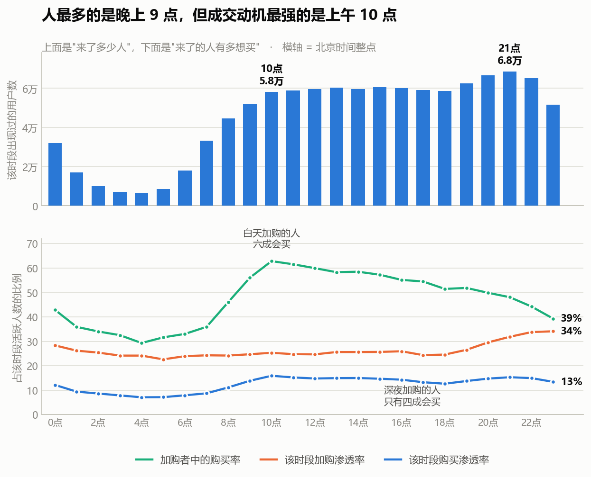
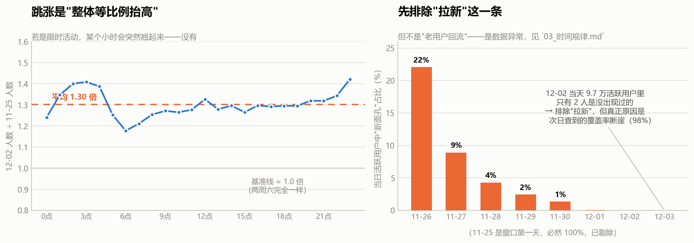

# S3 · 时间规律：用户什么时候最想买

> 对应脚本：`sql/sql_03_time.sql`（5 个结果集）
> 对应图：`output/charts/s3_hourly_shape.png`、`s3_spike_drilldown.png`

这一节要回答两个问题：**运营动作该排几点？** 以及 **12-02 那次跳涨到底是什么？**

---

## 1. 一天里的形态



先看上面那格（来了多少人）：

- **谷底在凌晨 4 点**，6,473 人
- 从 8 点起快速爬升，**午间 13-16 点有一个平台**（约 6 万人）
- **晚间 20-23 点是全天高峰**，21 点最高，68,331 人
- 0 点仍有 31,971 人——**凌晨 0 点的人比上午 8 点还多**，典型的电商夜猫子形态

到这里都很常规。真正有意思的是下面那格。

### 三个比率，一个落差

我算了三件事：

| 指标 | 含义 |
|---|---|
| 该时段购买渗透率 | 这个时段来的人里，有多少买了东西 |
| 该时段加购渗透率 | 这个时段来的人里，有多少加了购物车 |
| **加购者中的购买率** | 这个时段**加购过的人**里，有多少最终也买了 |

前两个看的是"来的都是什么人"，第三个看的是"**这个时段的加购，含金量有多高**"。第三个才是这一节的钥匙。

数字很干净：

| 时段 | 加购渗透率 | 加购者中的购买率 |
|---|---|---|
| 10:00 | 25.30% | **62.81%** ← 全天最高 |
| 13:00 | 25.61% | 58.28% |
| 15:00 | 25.65% | 57.24% |
| 20:00 | 29.56% | 49.84% |
| 22:00 | 33.77% | 44.23% |
| 23:00 | **34.10%** ← 全天最高 | **39.29%** |
| 04:00 | 24.15% | **29.30%** ← 全天最低 |

**两条线是反着走的。**

- **深夜**：来的人加购倾向最强（23 点有 34.10% 的人加购，全天最高），但这些人加购完之后，**只有 39.29% 真的买了**。
- **白天 10 点**：加购倾向其实一般（25.30%），但加购的人里**62.81% 真的买了**，全天最高。

也就是说：

> **深夜的加购，和白天同样是"加购"，但含义不一样。**
>
> 白天把东西放进购物车的人，六成以上是真要买；深夜放进去的人，只有不到四成会买。
>
> 凌晨 4 点最极端——加购的人里只有 29.30% 会买，全天最低。

### 这和 S2 的结论对上了

S2 从商品配对的角度得出结论：**购物车不是待付款清单，是比价清单**——加进去的东西只有 6.47% 会被同一人买回。

S3 从时间角度撞到了同一件事：**深夜的加购尤其不像"准备买"**，更像"先存着，改天再说"。

两条完全不同的分析路径——一条按商品配对，一条按小时切分——指向了同一个结论。**这种独立验证比任何单一分析都更有说服力**，因为它排除了"某一种算法造成的假象"。

### 那"人最多的时候"到底是不是"最想买的时候"？

严格说，**购买渗透率的峰值确实在白天**（10 点 15.89%，全天最高；21 点是 15.30%），但两者只差 0.6 个百分点，**这个差距太小，不值得当作结论说**。

真正有落差的是**加购的含金量**：10 点 62.81% vs 23 点 39.29%，差了 **23.5 个百分点**。这才是能拿去开会说的数字。

### 一句人话结论

人流高峰在晚上 9 点，但**"逛"的高峰和"认真想买"的高峰不是一回事**——深夜来的人加购最积极，含金量却最低。

### 对运营动作意味着什么

1. **大促、限时活动的起止时点**应该避开 23 点之后的深夜段。那个时段人来得多、加购也多，看着热闹，但转化最差——数据好看、结果不好。
2. **上午 10 点前后是"高意图时段"**，适合推送限时优惠、发券、做"今日特价"——这时候的人加购了就是真要买，催一下是顺水推舟。
3. **深夜的加购用户不要立刻催**。"你购物车里的商品降价了"这种提醒在下午发，命中率会比半夜发高得多（62.81% vs 39.29%）。

---

## 2. 12-02 那次跳涨，到底是什么

S1 留了个尾巴：12-02 活跃用户比前一天多了 31%，同期的人均行为数却没变。S1 当时猜是"新用户来了"——**猜错了**。这一节把它查清楚。



### 排除法一：是不是限时活动？

限时活动通常有明确的起止时点——某个小时会突然翘起来。

我把两个**同为周六**的日期（11-25 和 12-02）按小时做了个比值：

- 凌晨 6 点：1.18 倍
- 上午 10 点：1.27 倍
- 晚上 9 点：1.32 倍
- 全天平均：**1.30 倍**

**线基本是平的。** 没有任何一个小时出现异常尖峰。

结论：**不是限时活动。** 活动会有明确的起止时点，而这里是全天等比例抬高——像是"人变多了"，不是"某一刻发生了什么"。

> 小提醒：凌晨几个小时的比值波动较大（从 1.18 到 1.42）。这是小样本噪声——凌晨本来就人少，基数小的时候比值容易抖。不能把 1.42 当成"凌晨被拉动了"。

### 排除法二：是不是拉来了新用户？

直接查：**12-02 当天的 9.7 万活跃用户里，有多少是这 9 天窗口内第一次出现的？**

答案是 **2 个人**。12-03 是 **0 个**。

| 日期 | 当日活跃 | 窗口内首次出现 | 新面孔占比 |
|---|---|---|---|
| 11-26 | 71,742 | 15,823 | 22.06% |
| 11-27 | 71,151 | 6,338 | 8.91% |
| 11-28 | 71,127 | 3,057 | 4.30% |
| 11-29 | 72,210 | 1,775 | 2.46% |
| 11-30 | 73,187 | 996 | 1.36% |
| 12-01 | 74,158 | 38 | 0.05% |
| **12-02** | **97,232** | **2** | **0.00%** |
| **12-03** | **96,870** | **0** | **0.00%** |

**不是拉新。** 多出来的两万多人，全都是 11-25 ~ 12-01 期间已经出现过的老用户。

> **有一个必须说清楚的点**：这列数字整体是递减的，从 22% 一路降到 0。这**有一部分是必然的**——窗口越往后，"还没出现过的人"这个池子本来就越来越小。所以不能说"11-26 的新客质量比 11-30 好"。
>
> 但对我们这个问题来说，递减恰恰是**关键证据**：到 12-01 时新面孔池已经耗尽（只剩 38 人），12-02 增长 31% 却只带来 2 个新面孔——**说明这次跳涨在结构上不可能是拉新，只能是老用户回流。**

### 排除法三：到底来了多少人？——查到这里结论反转了

前面两条排除（不是活动、不是拉新）做完，我本来准备写"一批老用户集中回流"。但在 S4 算留存矩阵时，算出了**一个不可能的数字**：

```
队列 11-25 的 D7 回访率 = 98.54%
队列 11-25 的 D1 回访率 = 78.77%
```

**第 7 天的回访率比第 1 天还高。** 留存不可能反弹，所以肯定哪里错了。查下来是这两天的数据本身有问题：

| 日期 | 当日活跃用户 | 全体用户 | 当日活跃覆盖率 |
|---|---|---|---|
| 11-25 ~ 11-30 | 70,991 → 73,187 | 99,020 | 71.7% → 73.9% |
| 12-01 | 74,158 | 99,020 | 74.89% |
| **12-02** | **97,232** | 99,020 | **98.19%** |
| **12-03** | **96,870** | 99,020 | **97.83%** |

**12-02 那天，99,020 个用户里有 97,232 个是活跃的——覆盖率 98.19%。**

前 7 天这个数字稳定在 72~75%，然后**一天之内跳到 98.19%**。

这不是"一批老用户回来了"，这是**几乎所有用户那天都来了**。

而一个真实的电商平台，不可能在某一个普通的 12 月 2 日让 98% 的用户同时上线。对照一下：一个典型用户在这 9 天里活跃 7.06 天（活跃率约 78%），所以任意一天活跃率在 78% 左右是正常的——98% 意味着"几乎没有人缺席"，这在自然业务里不成立。

### 所以我改口

我原来准备写的"老用户集中回流"**不准确**。准确的表述是：

> **12-02 / 12-03 两天的覆盖率出现断崖式跳变（74.89% → 98.19%），这不像自然业务现象，更像数据层面的问题——比如数据集最后两天的抽取边界与前 7 天不同。**
>
> **但我无法从这份数据证实这个猜测**，只能说它不符合业务常识。

**处理方式**：我不去解释它，也不使用它。S4 的留存分析**把这两天从观察窗里剔除了**（窗口截止到 12-01），否则任何"第 N 天回访"都会被这两天污染——上面那个 98.54% 就是没剔除的后果。

> **这一条是本项目里最值钱的一次自我纠错。** 它不是我发现了什么新规律，而是我**发现自己的数据有问题，并且是在一个完全不相关的分析（S4 留存）里发现的**。
>
> 注意发现的路径：不是"我怀疑数据有问题所以去查"，而是"**我算出了一个不可能的数字（D7 > D1），顺着它查下去，才撞上这个断崖**"。
>
> 和 S2 那个 171.79% 是同一个套路：**不可能的数字是数据给你的报警信号**。比率超 100%、留存反弹、转化率飙升——这些"物理上不该出现"的数值，永远值得停下来查，而不是当成巧合跳过。

### 一句人话结论

12-02 的跳涨，既不是周末效应、也不是限时活动、更不是拉新。查到底发现**当天全体用户有 98.19% 活跃**，而前 7 天只有 72~75%——这个断崖不符合业务常识，我判断是数据层面的问题，但因无法证实，**选择不使用这两天的数据**。

---

## 3. 这一节的结论

1. **典型电商双峰形态**：午间 13-16 点一个平台，晚间 20-23 点最高峰（21 点，68,331 人），凌晨 4 点谷底。0 点的人比早 8 点还多。
2. **"逛"的高峰不等于"买"的高峰**：真正有落差的是**加购的含金量**——上午 10 点加购的人 62.81% 会买，深夜 23 点加购的人只有 39.29%。
3. **这是对 S2 结论的独立验证**：S2 从商品配对得出"购物车是比价清单"，S3 从时间维度撞到同一件事——深夜的加购尤其不像"准备买"。两条独立路径指向同一结论，比单一分析可信得多。
4. **12-02 / 12-03 是数据异常，不是业务现象**：这两天全体用户覆盖率断崖跳到 98%，前 7 天只有 72~75%。已从 S4 的观察窗剔除。既不是周末效应、不是限时活动、也不是拉新。

## 4. 面试可以这么说

> "我先看了一天的小时分布，很常规——晚上 9 点人最多。但我觉得'人最多'和'最想买'是两回事，所以算了一个别人不太算的指标：**某个时段加购过的人里，有多少最终也买了**。
>
> 结果这条线跟活跃度完全是反的：上午 10 点加购的人 62.8% 会买，深夜 23 点加购的人只有 39.3%。深夜的人加购最积极（34% 的人加购，全天最高），但含金量最低。
>
> 这跟我 S2 的结论对上了——S2 发现加购的商品只有 6.47% 被同一人买回，我说购物车是比价清单。S3 从时间维度独立撞到了同一件事：深夜的加购尤其不像'准备买'。**两条完全不同的分析路径指向同一个结论，这种验证比单一分析可信得多。**
>
> 另外 S1 留了个尾巴，12-02 活跃用户突然涨了 31%。我先排除了限时活动——按小时看，两个周六的比值全天稳定在 1.3 倍，没有突变时点；又排除了拉新——当天 9.7 万活跃用户里只有 2 个是首次出现。
>
> 本来我准备写'老用户集中回流'，结果在做留存分析时算出一个不可能的数：某个队列第 7 天的回访率 98.5%，比第 1 天的 78.8% 还高。**留存不可能反弹**，顺着这个错数查下去，发现 12-02 那天全体 9.9 万用户里有 9.7 万是活跃的，覆盖率 98.2%，而前 7 天稳定在 72~75%。
>
> 这不是业务现象，是数据问题。我没有用它，把这两天从留存窗口里剔除了。这件事教我的是：**算出来'物理上不该存在'的数字，永远要停下来查——它是数据在给你报警。**"

---

## 5. 局限

- **"该时段出现过的用户数"不是当天人数。** 同一个人在不同天都出现在 20 点，只算一次。所以 24 个小时加起来远大于 99,020。这个口径适合回答"谁会在这个时段出现"，不适合回答"总量"。要看总量请用 S1 的每日概览。
- **各时段的口径是 9 天合计**，不是"某一天的小时曲线"。所以本节的形态是**九天平均形态**，单日的异常（比如 12-02）会被平掉。12-02 的逐小时数据单独列在结果 4 里。
- **12-02 / 12-03 判定为数据异常，处理方式是"不使用"而非"解释"。** 数据集无活动字段、无渠道字段，我无法证实它到底是什么原因，只能说覆盖率 98% 不符合业务常识。因此这两天的数据在 S4 及之后一律排除出观察窗。**如果后续分析（S5 复购、S6 类目）用到逐日数据，也必须先剔除这两天。**
- **凌晨时段样本小**，比值和渗透率的波动大，解读时要谨慎，不要拿凌晨的小时去下强结论。
