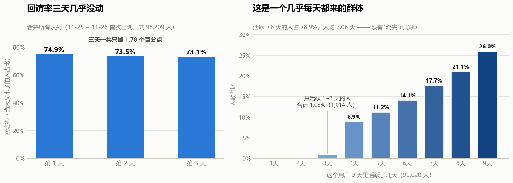
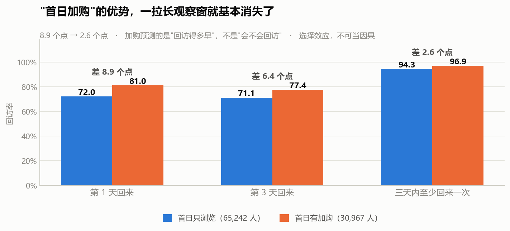

# S4 · 日活留存：这一节真正值钱的，不是留存结论

> 对应脚本：`sql/sql_04_retention.sql`（5 个结果集）
> 对应图：`output/charts/s4_why_flat.png`、`s4_firstday_gap.png`

按标准分析框架，这一步该回答："来逛过的人，过几天还会不会来？留存曲线掉得多快？"

我把这套流程完整跑了一遍，结果是：**留存曲线不掉。而且这一节最大的产出也不是这个结论，是我在做留存的时候，算出了一个不可能的数字，顺着它把上一节（S3）的结论整个推翻重写了。**

先把口径说清楚，否则这一节每一句话都是错的。

---

## 0. 先说清楚：这一节的"留存"是代理口径，不是真留存

真正的留存分析需要**注册时间**。有了它，才能定义"第 1 天注册的那批人，第 7 天回来了多少"。

**这份数据没有注册时间，也没有首访时间。** 五个字段里只有 user_id / item_id / category_id / behavior / timestamp，没有一个是用户属性。

所以只能用**"在这 9 天窗口里第一次出现的那天"**冒充"注册日"。这个替代品有个致命缺陷：

> **窗口的第一天（11-25），会把所有本来就已经存在的老用户全部算成"新用户"。**

有多严重？11-25 这一天"新增"了 **70,991 人**，占全体 99,020 人的 **71.7%**。剩下 8 天加起来才 28,029 人。也就是说，这个"首批队列"根本不是一批新用户，它是**一个什么人都往里装的桶**。

因此这一节全程遵守一条纪律：

> **一律说【回访率】，不说"新客留存"。** 回访率的意思是"距离他第一次露面 N 天后，他又出现了"——它描述的是行为节奏，不是用户生命周期。

这条纪律必须写进文档，因为这两个词在面试里是会被追问的。

---

## 1. 标准问题：回访率会衰减吗



把 11-25 ~ 11-28 首次出现的四个队列合并起来（共 96,209 人），看他们在第 N 天的回访率：

| 距离首次出现的天数 | 队列人数合计 | 回访率 |
|---|---|---|
| 第 1 天 | 96,209 | 74.90% |
| 第 2 天 | 96,209 | 73.46% |
| 第 3 天 | 96,209 | 73.12% |

**三天一共掉了 1.78 个百分点。**

正常的留存曲线长什么样？第一天掉到 30~40%，第七天掉到 10% 上下——陡降之后趋平。这里是一条**几乎水平的线**。

再看左边那张图的横轴起点：我从 0 开始画，没有把纵轴裁到 70% 再放大。**如果我裁了轴，这条"线"看起来会更平——那是画出来的平，不是数据里的平。** 从 0 起画，才能看出它确实是 75% 上下不动，而不是"勉强维持"。

### 为什么不掉？答案在右图

每个用户在这 9 天里活跃了几天：

| 活跃天数 | 人数 | 占比 |
|---|---|---|
| 9 天 | 25,709 | 25.96% |
| 8 天 | 20,895 | 21.10% |
| 7 天 | 17,531 | 17.70% |
| 6 天 | 13,956 | 14.09% |
| 5 天 | 11,103 | 11.21% |
| 4 天 | 8,812 | 8.90% |
| 3 天 | 898 | 0.91% |
| 2 天 | 101 | 0.10% |
| 1 天 | 15 | 0.02% |

- **活跃 6 天及以上的人占 78.85%**
- **活跃 3 天及以下的人只占 1.03%（1,014 人）**
- 人均活跃 **7.06 天**（共 9 天）

这不是一条留存曲线该有的人群结构。**这是一个"几乎每天都来"的群体，里面根本没有"流失的人"可以掉。**

### 这是同一个坑的第三次显形

回头串一下：

| 步骤 | 标准框架预期 | 实际结果 | 同一个根因 |
|---|---|---|---|
| S1 | 购买用户占个位数 | 68.05% | 数据被筛选过 |
| S2 | 漏斗有单点卡点 | 75.3% 与 71.9%，只差 3.4 个点 | 没有明显卡点 |
| S4 | 留存曲线衰减 | 三天掉 1.78 个百分点 | 没有流失用户 |

三次都指向同一件事：**这份数据不是全站流量，是一批已经被筛过的活跃 / 有购买倾向的用户。** S1 发现的那个 68%，到 S4 又换了一张脸出现。

这件事本身比任何一条留存结论都更值得讲——它说明**"标准框架套不上"不是一个可以绕过的意外，而是这份数据的固有属性**。绕过去硬套，就会写出"留存健康度良好，建议加强召回"这种废话。

> **一个可以泛化的判断方法**：当你在一个小样本、短窗口、"看起来是用户全量其实是被筛过的"数据集上做留存，先算一下**人均活跃天数 / 窗口长度**。这个比值接近 1（这里是 7.06 / 9 = 78%），留存分析就不用做了——没有可流失的余量。
>
> 这个检查只要一行 SQL，但能在开工前省掉一整节白做的分析。

---

## 2. 意外收获：一个不可能的数字，把数据问题揪出来了

这一节最重要的产出不在上面，而在下面。

我第一版留存矩阵是把 9 天全用上的。跑出来是这样：

```
队列 11-25 的 D7 回访率 = 98.54%
队列 11-25 的 D1 回访率 = 78.77%
```

**第 7 天的回访率比第 1 天还高。**

留存不可能反弹——它是个单调不增的东西。第 7 天回来的人，必然是第 1 天之后没流失的那部分。出现反弹，只可能是数据错了。

顺着这个错数往回查，查到的是：

| 日期 | 当日活跃用户 | 全体用户 | 当日活跃覆盖率 |
|---|---|---|---|
| 11-25 ~ 11-30 | 70,991 → 73,187 | 99,020 | 71.7% → 73.9% |
| 12-01 | 74,158 | 99,020 | 74.89% |
| **12-02** | **97,232** | 99,020 | **98.19%** |
| **12-03** | **96,870** | 99,020 | **97.83%** |

**12-02 那天，99,020 个用户里有 97,232 个是活跃的。**

前 7 天稳定在 72~75%，一天之内跳到 98.19%。而一个典型用户在这 9 天里活跃 7.06 天（活跃率 78%），所以任意一天有 78% 的人出现是正常的；**98% 意味着"几乎没有人缺席"，这在自然业务里不成立。**

处理方式：**判定为数据异常，把观察窗截止到 12-01，这两天不使用。** 上面所有的回访率都是在这个窗口下算的。如果用了那两天，任何一个"第 N 天回访"都会被污染成没有意义的数字。

> **完整的过程写在 `03_时间规律.md` 的"排除法三"。** 这里只记一句：这一节是那个结论的**发现现场**。
>
> 发现的路径值得单独强调：**不是"我怀疑数据有问题所以去查"，而是"我算出了一个不该存在的数字，顺着它查下去，撞上了断崖"。**
>
> 这和 S2 那个 171.79% 是同一个套路。到这一步，我可以说这是一条可复用的纪律了：**物理上不该出现的数值——比率超 100%、留存反弹、覆盖率断崖、转化率飙升——永远停下来查，它是数据在给你报警。**

---

## 3. 唯一可能开出动作的发现：首日加购



这一节唯一有业务味道的问题是：**第一次露面那天的行为，能不能预测他后面还来不来？**

按"首次出现当天有没有加购"把用户分成两组：

| 分组 | 人数 | 第 1 天回来 | 第 3 天回来 | **三天内至少回来一次** |
|---|---|---|---|---|
| 首日只浏览 | 65,242 | 72.03% | 71.07% | **94.28%** |
| 首日有加购 | 30,967 | 80.95% | 77.44% | **96.89%** |
| **差距** | — | **8.92 个点** | **6.37 个点** | **2.61 个点** |

这张表最值得看的是**最后一列**。

单看第 1 天，8.92 个点的差距，很容易写成"加购用户的忠诚度显著更高，应引导用户加购"。

**但把观察窗从"第 1 天"拉宽到"三天内任意一天"，差距从 8.92 个点坍缩到 2.61 个点。** 三天内，两组人的回访率分别是 94.28% 和 96.89%——**都在 95% 上下，几乎没有区别。**

所以准确的结论是：

> **首日加购预测的是"回访得多早"，不是"会不会回访"。**
>
> 加购过的人第二天更可能就回来了，但那些只浏览的人，多给两天时间也基本都会回来。**这不是一个"量"的差距，是一个"时机"的差距。**

### 而且这连因果都不是

即使上面那个 2.61 个点是真的，也不能说"引导用户加购能提升回访"。原因是**选择效应（selection effect）**：

> 会主动把商品加进购物车的人，本身就是**意图更强、更可能回访**的那批人。是"这个人本来就打算回来"同时导致了他"加购"和"回访多"，而不是加购导致了回访。

要证明因果，得做 A/B 实验：随机把一批用户分成两组，一组弹窗引导加购、一组不弹，再看回访率差异。**本数据做不到，所以这一条只能作为描述性发现，不能作为因果结论。**

> 面试里如果只讲"加购用户回访率高 8.9 个点"，讲完就完了；如果补上"但拉长窗口差距只剩 2.6 个点，而且这是选择效应不是因果"，这一条的分量完全不同。**主动说出自己结论的边界，比结论本身更能证明你想清楚了。**

---

## 4. 一个我查了、但决定不用的数

留存矩阵里还有一个数让我停下来看了一眼：

| 首次出现日 | 队列人数 | D1 | D2 | D3 |
|---|---|---|---|---|
| 11-25 | 70,991 | 78.77 | 76.76 | 75.95 |
| 11-26 | 15,823 | 65.24 | 64.79 | 65.70 |
| 11-27 | 6,338 | 61.50 | 62.54 | 64.41 |
| 11-28 | 3,057 | 62.90 | 64.54 | 63.79 |
| 11-29 | 1,775 | 68.28 | 72.62 | — |
| **11-30** | **996** | **94.48** | — | — |
| 12-01 | 38 | — | — | — |
| 12-02 | 2 | — | — | — |

**11-30 队列的 D1 是 94.48%**，而相邻队列是 68.28% 和 62.90%。我专门写了一条查询去验证，确认不是算错——996 人里有 941 人次日回来了。

队列人数从 70,991 一路降到 996，这个是**必然的**（"还没出现过的人"这个池子本来就越来越少），不是发现。

但 94.48% 这个跳变我解释不了。它和 11-26 ~ 11-29 的 61~68% 完全不是一个量级，而 11-30 恰好紧挨着 12-02 那个覆盖率断崖。**我怀疑它和那个断崖是同源的数据问题，但这份数据不支持我证实。**

所以处理方式和 12-02 一样：**不使用，也不编原因。** 好在它只有 996 人（占全体 1%），而且合并曲线只用了 11-25 ~ 11-28 四个队列（能完整观察到第 3 天的那几个），它影响不到上面的结论。

> 这是我在这个项目里**第二次**遇到"解释不了的数"。和第一次的区别是：第一次我急着给它安原因（先猜"新用户"，再猜"老用户回流"），两次都错了；这一次我是先查证它是不是真的，确认是真的之后，**直接标注为"不使用"**。
>
> **能接受"我不知道"，是这一节我自己最看重的变化。**

---

## 5. 一句人话结论

这份数据里**没有留存问题可做**——因为它的人均活跃天数是 7.06 天（共 9 天），79% 的人至少活跃 6 天，只来 1~3 天的人只有 1%。留存曲线是一条平线，不是"留存做得好"，是**没有可流失的人**。

---

## 6. 面试可以这么说

> "这一步我按标准留存分析跑了一遍，但结论是**这个框架在这份数据上不成立**。
>
> 先说口径：数据没有注册时间，我只能用'窗口内首次出现'冒充新用户，所以严格说这是回访率不是留存率。而且窗口第一天会把 71.7% 的老用户全算成新客，我在文档里专门标了这一点。
>
> 算出来的回访率，第 1 天 74.9%，第 3 天 73.1%，三天只掉 1.78 个百分点。正常留存曲线第一天就该掉到三四成。我去查了为什么——每个用户这 9 天里平均活跃 7.06 天，79% 的人至少活跃 6 天，只活跃 1 到 3 天的只有 1%。**这是一个几乎每天都来的群体，里面没有流失的人可以掉。** 这与我在第一步发现的'购买用户占 68%'是同一个根因：这份数据是被筛过的活跃用户集。这是我第三次撞上同一堵墙。
>
> **但这一节真正重要的是另一件事。** 我第一版留存矩阵把 9 天全用上了，跑出来一个数：某个队列的第 7 天回访率 98.5%，比第 1 天的 78.8% 还高。留存不可能反弹，所以肯定是数据错了。顺着查下去发现，12-02 那天全体 9.9 万用户里有 9.7 万活跃，覆盖率 98.2%，而前 7 天稳定在 72 到 75%。这是数据问题，不是业务现象，我把这两天剔除出观察窗了。
>
> 我把这条写成了一句可以复用的纪律：**算出来物理上不该存在的数字，永远停下来查——它是数据在报警。** 这不是我怀疑数据才去查的，是那个数自己跳出来告诉我的。
>
> 最后有一个能开动作的发现：首次露面当天加购过的人，第 1 天回访率 81.0% 对 72.0%，高 8.9 个点。但我把窗口拉宽到三天内任意一天，差距缩到 2.6 个点，两组人都在 95% 左右。所以加购预测的是**回访得多早**，不是**会不会回访**。而且它是选择效应，不能当因果——要验证得做 A/B 实验。"

---

## 7. 局限

- **"回访率"不是"留存率"。** 没有注册时间，只能用窗口内首次出现日替代，11-25 那个队列把 71.7% 的老用户算成了新客。所有数字只能解读为行为节奏，不能解读为生命周期。
- **观察窗截止 2017-12-01。** 12-02 / 12-03 覆盖率断崖（98% vs 前 7 天 72~75%），判定为数据异常后剔除。**S5 及之后任何用到逐日数据的分析，都必须先剔这两天。**
- **只有 9 天窗口，"第 3 天"就到头了。** 真正的留存分析要看 D1 / D7 / D30，这里最多只能看到 D3，长期留存问题本数据回答不了。
- **11-30 队列的 D1（94.48%）无法解释，已标注不使用。** 队列 996 人，占全体 1%，不影响合并曲线（只用 11-25 ~ 11-28 四个队列）。
- **"首日加购"那一组是选择效应，不是因果。** 想证实需要 A/B 实验，本数据无实验设计字段。
- **回访率普遍偏高是筛选造成的**，不能拿去和真实业务对标，只能做组间横向比较。这与 `00_口径与数据说明.md` 的口径 3 一致。
