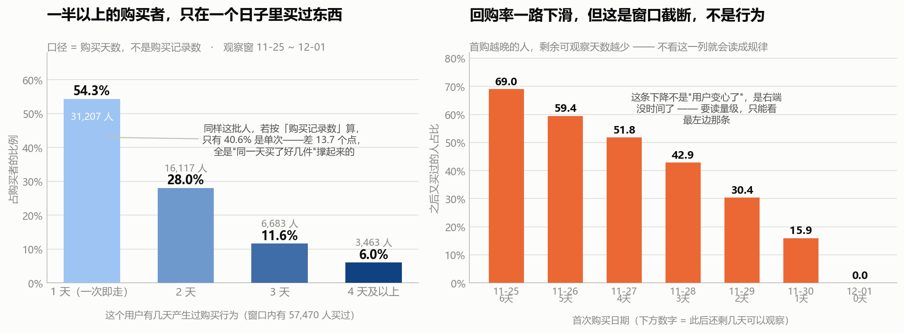
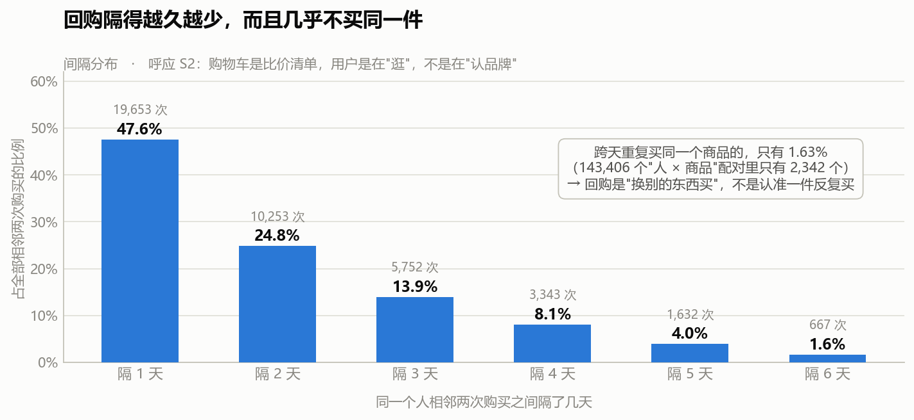

# S5 · 复购：买过一次的人，还会不会再来买

> 对应脚本：`sql/sql_05_repurchase.sql`（6 个结果集）
> 对应图：`output/charts/s5_one_and_done.png`、`s5_repeat_pattern.png`

前四步看的是"人怎么来、来了干什么、什么时候来、还会不会来"。这一节换一个角度：**已经掏过钱的人，会不会再掏一次。**

标准问题是"复购率是多少"。但这份数据有一个硬伤，导致"复购率"可以算出两个完全不同的值。所以这一节仍然从口径开始。

---

## 0. 没有订单号，所以"复购"有两种算法

真实电商数据里有订单号，一张订单可能包含多个商品。**这份数据没有订单号。**

五个字段是 user_id / item_id / category_id / behavior / timestamp。一条 `buy` 记录的含义是"**某人在某时刻对某个商品发生了一次购买动作**"。

这就带来一个歧义：**同一天买了 3 件商品，会留下 3 条 buy 记录。**

于是"这个人复购了吗"就有两种算法：

| 口径 | 定义 | 问题 |
|---|---|---|
| **购买记录数 > 1** | 有多于一条 buy 记录 | 同一天买 3 件也算"复购" |
| **购买天数 > 1** | 在多于一个日期产生过购买 | 跨天才是真的又来了 |

**两个口径差多少？**

| 口径 | "只买过一次"的人占比 |
|---|---|
| 按购买记录数 | 40.57%（23,313 / 57,470） |
| 按购买天数 | **54.30%**（31,207 / 57,470） |
| **差距** | **13.73 个百分点** |

**同样一批人，同样一份数据，换个口径，"一次即走"的比例差了将近 14 个点。** 那 14 个点，全部是"在同一个日子里买了好几件商品"的人——他们行为上是**一次购物**，但记录上是**多条购买**。

> 这和 S1 那个"记录数 2.01% 对人数 68.05%"是同一堂课的第二遍：**凡是"次数"类的指标，必须先问一句"这个次数的单位是什么"。** 记录数、天数、人数是三样东西，混用就会出现 14 个点的偏差。
>
> **本节的"复购"一律用【购买天数 > 1】这个口径。**

还有一个必须说清楚的前提：**这一节所有数字的观察窗是 11-25 ~ 12-01**（12-02/12-03 是 S3/S4 查实的数据异常，已剔除），窗口内有 **57,470 人**产生过购买行为。

---

## 1. 一次即走：一半以上的购买者

按购买天数分层：

| 有几天买过 | 人数 | 占购买者比例 |
|---|---|---|
| **1 天（一次即走）** | **31,207** | **54.30%** |
| 2 天 | 16,117 | 28.04% |
| 3 天 | 6,683 | 11.63% |
| 4 天及以上 | 3,463 | 6.03% |

**超过一半的购买者，在窗口内只在一个日子里买过东西。**

而且这个数字**是被高估的**——因为窗口只有 7 天，任何"只买过一天"的人，都有可能是"还没来的及买第二次"。后面第 2 小节会专门处理这个偏差。

### 和 RFM 项目的跨项目互证

我在之前的电商 RFM 项目里得到过一个结论：**约三成客户只买过一次。**

这一节如果只看**观察时间最长的那个队列**（11-25 首次购买，此后还有 6 天可观察，13,098 人）：回购率 68.97%，也就是 **31.03% 的人一次即走**。

**31.03% —— 和 RFM 项目里那个"约三成"几乎一模一样。**

两个项目、两个数据集、两个完全不同的计算路径（一个是订单金额的 RFM 分层，一个是行为事件流的购买天数），落到了同一个数字上。这种跨项目互证是**最有说服力的验证**——它排除了"某个数据集的结构特点造成的巧合"。

> 但要注意：这只是"数字对上了"，不代表两个数据集描述的是同一批消费者。RFM 项目的数据是另一个来源、另一个时间段。这里是**量级上的呼应**，不是**同一群人的追踪**。

---

## 2. 回购率一路下滑——但它自己在往下掉，是因为窗口

（上图右格即本小节的图。）

按"首次购买日期"分组，看这些人**之后**还会不会再买：

| 首次购买日 | 首购人数 | 此后还剩几天可观察 | 之后又买过的人 | 回购率 |
|---|---|---|---|---|
| 11-25 | 13,098 | **6 天** | 9,034 | **68.97%** |
| 11-26 | 10,579 | 5 天 | 6,288 | 59.44% |
| 11-27 | 9,433 | 4 天 | 4,886 | 51.80% |
| 11-28 | 7,341 | 3 天 | 3,147 | 42.87% |
| 11-29 | 6,507 | 2 天 | 1,977 | 30.38% |
| 11-30 | 5,841 | **1 天** | 931 | **15.94%** |
| 12-01 | 4,671 | **0 天** | 0 | 0.00% |

**这条线从 69% 一路滑到 16%，看着像一个漂亮的结论——"越晚来的用户质量越差"。**

**它是假的。**

请一起看第三列"此后还剩几天可观察"：**它和回购率是同一条下滑线。** 11-25 首购的人有 6 天时间可以再买，11-30 首购的人只有 1 天。12-01 首购的人一天都没有——**回购率必然是 0，这不是"没人回购"，是"根本没时间回购"。**

这就是**窗口截断（right-censoring）**：观察窗在右边被切断了，越靠近右端的人，被观察到的机会越少。

> **一个必须养成的习惯**：凡是**跨时间**算出来的比率（回购率、转化率、留存率），都要按时间维度切开看一眼。如果这个比率和"剩余可观察时长"同步下滑，那它测的是窗口，不是行为。
>
> S4 的留存矩阵（第 3 天之后就没法观察了）用的是同一套检查。**这是本项目里第二次用它，说明它是一条通用纪律，不是一个特殊技巧。**

处理方式：**要读量级，只能读最左边那一列**（11-25 首购，6 天可观察，68.97%）。中间那几列只能用来做**组间横向比较**（比如"控制了观察时长之后，哪类人回购得更多"），不能读绝对值。

---

## 3. 回购是"换别的东西买"，不是认准一件反复买

看相邻两次购买之间的间隔：

| 间隔 | 次数 | 占比 |
|---|---|---|
| 隔 1 天 | 19,653 | 47.59% |
| 隔 2 天 | 10,253 | 24.83% |
| 隔 3 天 | 5,752 | 13.93% |
| 隔 4 天 | 3,343 | 8.09% |
| 隔 5 天 | 1,632 | 3.95% |
| 隔 6 天 | 667 | 1.62% |

大致每隔一天掉一半，很干净。但这条曲线的解读要小心——**这是一个"几乎每天都来"的群体（S4：人均活跃 7.06 / 9 天）**，所以他们"隔 1 天"占一半，很大程度上只是因为**他们本来就每天都来**，不是"回购周期短"。**不能说"回购周期是 1 天"。**

真正有信息量的是下面这个数：

> **143,406 个"人 × 商品"配对里，跨天重复买过同一个商品的，只有 2,342 个 —— 1.63%。**

也就是说：**用户确实会在后面几天又买东西，但几乎不会买同一个商品。**

这直接呼应了 S2 的结论（购物车是比价清单，加购商品只有 6.47% 被同一人买回）：

| 步骤 | 发现 | 说明什么 |
|---|---|---|
| S2 | 加购的商品，只有 6.47% 被同一人买回 | 放购物车不等于认准它 |
| S3 | 深夜加购的人只有 39.29% 会买 | 深夜的加购更不像"准备买" |
| **S5** | **回购同一个商品的只有 1.63%** | **回购也不是认准一件** |

**三条独立路径，指向同一个用户画像：这个平台上的用户是在"逛"，不是在"认品牌/认单品"。** 他们持续回访、持续购买，但每次买的是不同的东西。

> 这个结论对业务有直接含义：**在这份数据描述的场景里，做"单品复购率"、"品牌忠诚度"之类的指标没有抓手**——用户根本没有表现出单品层面的重复购买行为。想提高复购，重点不在"让他再买一次刚才那件"，而在"让他下次想买的时候还来这里"。

---

## 4. 一张我算出来、但决定不用的表

我原本还想看"跨天回购的人有什么特征"，算出来是这样：

| 分组 | 人数 | 人均购买事件 | 人均买过的商品数 | 人均买过的类目数 |
|---|---|---|---|---|
| 只在一天买过 | 31,207 | 1.42 | 1.38 | 1.31 |
| 跨天回购 | 26,263 | 4.01 | 3.82 | 3.48 |

差距很大——回购的人买了 3.82 件商品，一次即走的人只买了 1.38 件。很容易写成"回购用户品类探索更活跃"。

**但这张表是同义反复。** 一个人如果在 4 个不同日子都买了东西，他自然有更多机会买到更多商品——**"购买天数多"和"买过的商品数多"在构造上就是同一件事的两面**，不是因果关系，甚至不是相关关系，是定义重复。

**这张表我不使用。** 它唯一的用途是提醒自己：**分组变量和结果变量在构造上重叠时，算出来的"差异"是数学恒等式，不是发现。**

---

## 5. 一句人话结论

窗口内有 57,470 人买过东西，其中 **54.3% 只在一个日子里买过**（观察时长最长的那个队列是 31.0%，与 RFM 项目的"三成"吻合）。而**回购几乎从不针对同一件商品（1.63%）**——用户会回来、会再买，但每次买的是不同的东西。

---

## 6. 面试可以这么说

> "这一节我先卡在了口径上。数据没有订单号，一条购买记录只是'某人对某商品的一次购买动作'，所以同一天买三件就是三条记录。这样'复购'就有两种算法：按购买记录数算，只买过一次的占 40.6%；按购买天数算，占 54.3%。**同一批人差了将近 14 个点，全是'同一天买多件'造成的。** 我最后选了口径更严的购买天数。
>
> 按天数算，窗口内 57,470 个购买者里 54.3% 只在一个日子里买过。不过这个数被窗口压着——我只能观察 7 天。所以我做了窗口截断检验：按首次购买日切开看回购率，从 69% 一路掉到 16%。**这条下降线是假的**，因为它和'此后还剩几天可观察'那一列是完全同步的——最后一天首购的人剩余观察时间就是 0，回购率必然是 0。要读量级只能读观察时间最长的那个队列：11-25 首购的人里有 68.97% 又买过，也就是 31% 一次即走。**这个 31% 和我之前 RFM 项目里算出的'约三成客户只买一次'几乎一样，两个数据集两条路径撞到同一个数，这种互证比单一结论可信得多。**
>
> 最有意思的是最后一条：143,406 个'人 × 商品'配对里，跨天重复买同一个商品的只有 1.63%。**用户会回来、会再买，但几乎不买同一件。** 这和我在前面两步的发现是一致的——加购的商品只有 6.47% 被买回，深夜加购的转化只有 39%。三条独立路径指向同一个画像：**这里的用户是在'逛'，不是在'认品牌'。** 所以在这份数据里做'单品复购率'、'品牌忠诚度'没有抓手，想提复购，重点不在'让他再买一次那件'，在'让他下次还来这里'。"

---

## 7. 局限

- **观察窗只有 7 天**（11-25 ~ 12-01，已剔除异常的 12-02/12-03）。快消品的真实复购周期通常以周或月计，**本节测的是"短窗口内的回购倾向"，不能解读为"用户忠诚度"**。
- **没有订单号，"购买次数"是近似口径。** 一条 buy 记录 = 一次购买动作 ≠ 一张订单。本节的复购一律用"购买天数 > 1"定义，规避同一天多件的问题。
- **所有回购率都被右端截断压低**，只有观察时长最长的 11-25 队列（6 天可观察）能读量级，其余只能做组间横向比较。见第 2 小节的窗口截断检验。
- **"回购率高"有一部分是人口结构造成的。** S4 已证明这是一个几乎每天都来的群体（人均活跃 7.06 / 9 天），所以他们"又买了一次"的门槛本来就低。**这里的回购率含有很大成分的"还在用这个网站"，不是纯粹的购买意愿。**
- **间隔分布不能读成"回购周期"。** 隔 1 天占 47.6%，主要是因为人群本身几乎每天活跃，不是因为用户的复购周期是 1 天。
- **第 4 小节那张"回购用户特征"表因构造重叠而废弃**，此处记录以免后续被误用。
