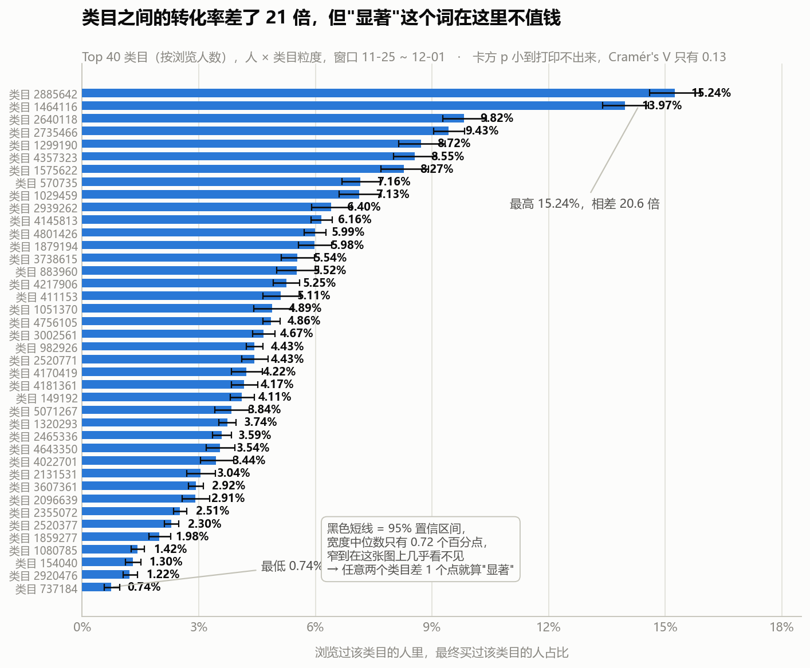
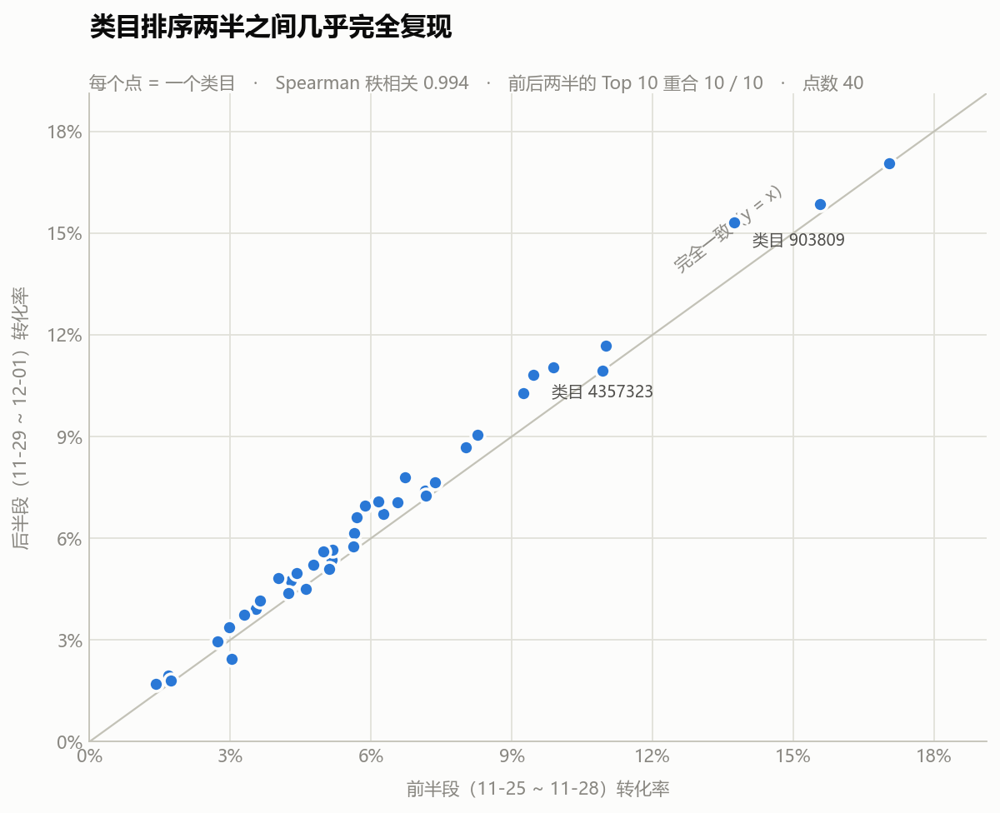

# S6 · 类目转化差异：显著不等于有用

> 对应脚本：`sql/sql_06_category.sql`（5 个结果集）、`code/06_chi_square.py`（检验 + 画图）
> 对应图：`output/charts/s6_category_spread.png`、`s6_split_half.png`

前五步都在看"整体"。这一节换一个切法：**把商品按类目切开，不同类目的转化率差多少？**

这个问题听起来很直白，但它是我在这个项目里**第一次动用统计检验**，也是我第一次遇到"检验结果本身会骗人"的情况。所以这一节的重点不在结论，在**怎么判断一个统计结论值不值得用**。

---

## 0. 口径：粒度是"人 × 类目"，不是行为记录

沿用前几节的口径纪律，先把单位钉死：

> 统计粒度 = **一个人对一个类目**。同一个人浏览了 A、B 两个类目，就在 A 里算一次、B 里算一次。

这样"浏览 → 购买"的分子分母才是可比的漏斗，而不是被同一个人的重复记录撑大。

- 分母：浏览过该类目的**去重人数**
- 分子：这些人里，也**购买过该类目**的人数

（注意是"购买过该类目"，不是"购买过该类目的这个东西"——后者在 S2 已经做过，结论是不能用 SKU 层面看，见 `02_交易漏斗主线.md`。）

---

## 1. 差异有多大：20 倍

按浏览人数取 Top 40 类目，转化率的范围是：

| | 转化率 |
|---|---|
| 最低（类目 737184） | **0.74%** |
| 最高（类目 2885642） | **15.24%** |
| **相差** | **20.6 倍** |

**同一个平台、同一个时间段、同一批用户，不同类目的转化率能差 20 倍。** 这个差距大到不需要任何统计检验就能看出来。

### 顺便看一眼"加购含金量"

S3 提出过一个指标：**加购者中的购买率**（加购过的人里有多少真买了）。它在类目维度上同样拉开：

| 类目 | 浏览到购买率 | 加购者中的购买率 |
|---|---|---|
| 1464116 | 13.97% | **19.84%** |
| 2735466 | 9.43% | 17.72% |
| 2920476 | 1.22% | **4.44%** ← 最低 |
| 1080785 | 1.42% | 5.55% |

两个指标是**同向的**：浏览转化率低的类目，加购含金量也低。这说明这两个指标测的其实是同一件事——**这个类目的用户是不是真的来买东西的**。如果某个类目浏览转化率高但加购含金量低，那才是有意思的异常；这里没有。

---

## 2. 卡方检验：p 值小到打印不出来

现在做标准的独立性检验：**"类目"和"买不买"这两件事，到底相不相关？**

检验用的是一张 40 × 2 的列联表（40 个类目 × 买过 / 没买过），总样本 **612,194** 个"人 × 类目"配对。

| 指标 | 值 |
|---|---|
| 卡方统计量 | **10,699.2** |
| 自由度 | 39 |
| **p 值** | **0.000e+00**（小到打印不出来） |
| **Cramér's V（效应量）** | **0.1322** |

p 值小到连科学计数法都打不出来了。按教科书说法，这叫"极其显著"，结论是"类目和购买行为高度相关"。

**这个结论是废话。** 因为 p 值回答的问题是"**这个差异有没有可能是抽样偶然造成的**"。当样本量是 61 万的时候，哪怕是 0.1 个百分点的差异，也不可能是偶然造成的——**p 值必然极小，它在这里不提供任何信息。**

> **这是大样本分析里最容易踩的坑**：把"显著"当成"重要"。
>
> 换个说法就清楚了：**p 值低只说明"差异是真的"，不说"差异值得管"。** 一个 61 万样本的 A/B 实验，转化率从 5.00% 提升到 5.05%，p 值同样会小到打印不出来——但这个提升没有任何业务价值。
>
> **规矩**：只要样本量上万，报差异就必须同时报**效应量**和**绝对差距**，只报 p 值的分析不能拿去开会。

那 Cramér's V = 0.13 是什么水平？**弱关联。**

> 但这里必须补一句诚实的话：**Cramér's V 的"0.1 弱 / 0.3 中 / 0.5 强"这套基准值，是按小表（2×2 之类）定的。**
>
> 40 行 × 2 列的表，V 的理论上限本身就不到 1，直接套那套基准并不严格。**所以我不拿 0.13 去说"关联强度是弱的多少级"**，我只用它说明一件事：**类目不是购买行为的决定性因素**——如果类目是决定性的，V 会接近它这个表型的上限，不会停在 0.13。
>
> 诚实地交代方法的适用边界，比硬套一个漂亮的数字更重要。

---

## 3. 为什么"显著"在这里不值钱：看看置信区间有多窄

见上图那些几乎看不见的黑色短线。

每个类目转化率的 **95% 置信区间**宽度：

| | 宽度 |
|---|---|
| 中位数 | **0.72 个百分点** |
| 最大 | 1.31 个百分点 |

**任意两个类目的转化率，只要差超过 1 个百分点，卡方就会判定为"显著"。**

再对照第 1 小节那张表：类目之间的差距是**从 0.74% 到 15.24%**。也就是说：

> **真正的差距（20 倍）比"显著"的门槛（1 个百分点）大了两个数量级。**

所以我前面说"p 值小到打印不出来"，它的真实含义是：**这么窄的置信区间，这么宽的类目差距，p 值不可能是大的。** 这早就是已知的事情了，检验没有带来任何新信息。

---

## 4. 真正该问的问题：这个差异稳定吗

p 值回答不了"值不值得管"，效应量回答得也不彻底。**真正决定这个结论能不能用的，是复现性。**

做法：**把 7 天窗口切成前后两半**（前半段 11-25 ~ 11-28，后半段 11-29 ~ 12-01），分别算每个类目的转化率，看两次算出来的是不是同一件事。

| 稳健性指标 | 值 |
|---|---|
| Spearman 秩相关（前后两半的排序一致性） | **0.994** |
| Pearson 相关 | 0.994 |
| 前后两半"转化率 Top 10"的重合个数 | **10 / 10** |

**几乎完全复现。** 前后两段只有 4 天左右的数据，样本各自小了一半，但类目的转化率排序几乎一模一样，Top 10 一个不差。

（图上离对角线最远的两个点，偏差也只有 1~2 个百分点。）

### 所以这一节的结论是

> **类目之间的转化率差异是真实且稳定的**——不是抽样噪声，也不是某种算法造成的假象。
>
> **因此"按类目定 KPI"这件事是有依据的。**
>
> **但这个依据不是来自 p 值。** p 值只说了"差异存在"，而"差异存在"我第 1 小节肉眼就看出来了。**让我敢下结论的是第 4 小节——同样的差异，换个时间窗口还能原样算出来。**

**这就是"显著 ≠ 有用"的完整答案**：显著只保证差异不是巧合，复现性才保证差异是可依赖的规律。

---

## 5. 一个必须说的限制：这 40 个类目只占四分之一

| 范围 | 占全部浏览人次 |
|---|---|
| Top 20 | 24.39% |
| Top 100 | **48.98%** |
| Top 500 | 74.45% |

数据里出现过 **7,775** 个类目（有浏览的 7,706 个，有购买的 4,619 个）。

**Top 20 只覆盖了不到四分之一的浏览人次，Top 100 也才刚刚过半。** 这是一条极长的长尾。

所以：

> **本节的结论只适用于流量最大的那几十个类目。** 长尾里的几千个类目，转化率可能和头部完全不同，本数据没法给出可靠结论——它们单个的样本量太小，算出来的转化率会被抽样波动主导（这正是前面那个"CI 宽度"要提醒的事）。

如果要做长尾分析，正确做法是**按类目流量分层**（比如万级 / 千级 / 百级），而不是逐个类目排榜。

---

## 6. 一句人话结论

不同类目的转化率**差了 20 倍**（0.74% ~ 15.24%），卡方检验 p 值小到打印不出来，但真正说明问题的是另外两件事：**效应量只有 0.13（类目不是决定因素）**、**95% 置信区间只有 0.72 个百分点（"显著"的门槛低得没有决策价值）**。而**分半复现的秩相关 0.994、Top 10 完全重合**，说明这个差异是真实稳定的——**按类目定 KPI 有依据，但这个依据来自复现性，不是来自 p 值。**

---

## 7. 面试可以这么说

> "这一步我想看不同类目的转化率差多少。跑出来最大 15.24%、最小 0.74%，差 20 倍。然后我做了卡方检验，61 万个'人 × 类目'配对，p 值小到连科学计数法都打不出来。
>
> **但我没有停在这里，因为这个 p 值没有信息量。** p 值回答的是'差异会不会是抽样偶然造成的'——样本量 61 万的时候，0.1 个百分点的差异都不可能是偶然，所以 p 值必然极小。我算了一下效应量 Cramér's V，只有 0.13，说明类目不是购买行为的决定性因素。同时我算了每个类目转化率的 95% 置信区间，宽度中位数只有 0.72 个百分点——**意味着任意两个类目差 1 个点就算'显著'，而实际差距是 20 倍。'显著'这个门槛在这里低得没有任何决策价值。**
>
> 那到底该不该按类目定 KPI？**我去做了复现性检验**：把 7 天窗口切成前后两半分别算，Spearman 秩相关 0.994，前后两半的 Top 10 类目一个不差。**所以差异是真实且稳定的，按类目定 KPI 有依据——但这个依据来自复现性，不是来自 p 值。**
>
> 这一节的收获是一条纪律：**样本量上万之后，报差异必须同时报效应量和绝对差距，只报 p 值的分析不能拿去开会。**
>
> 最后我补了一个限制：这 40 个类目只占了不到一半的浏览人次，数据里总共有 7,775 个类目，长尾极长。**所以我的结论只适用于头部类目**，长尾类目单个样本量太小，算出来的转化率会被抽样波动主导。"

---

## 8. 局限

- **结论只覆盖头部类目。** Top 20 占浏览人次 24.39%，Top 100 占 48.98%。数据里共 7,775 个类目，长尾部分本数据无法给出可靠结论。做长尾应改用分层方法，不逐个排名。
- **Cramér's V 的强度基准不适用于 40 行的表。** 本文只用它说明"类目不是决定性因素"，不用它标注关联强度的等级。
- **卡方检验假设各观测独立。** 但同一个人会浏览多个类目，这些观测并不严格独立（存在个体效应）。因此 p 值**偏向于更小**——这正好又一次说明本节的 p 值不能当证据用。要严格处理应改用混合效应模型或按用户聚类稳健标准误。
- **类目 ID 没有名称。** 数据集只给了 category_id，没有类目名称，所以只能说"类目 2885642"，无法给出业务上可读的品类名。这是数据本身的信息缺失，不是我漏了。
- **窗口只有 7 天**（已剔除异常的 12-02/12-03）。类目转化率可能随季节变化，本节的数值只代表这一周。
- **转化率绝对值普遍偏高**（受 S1 的筛选影响），只能做类目之间的横向比较，不能和真实业务对标。
