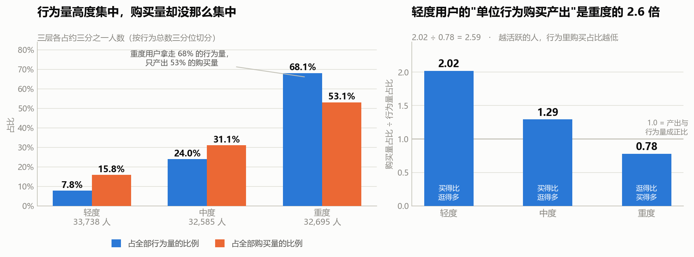
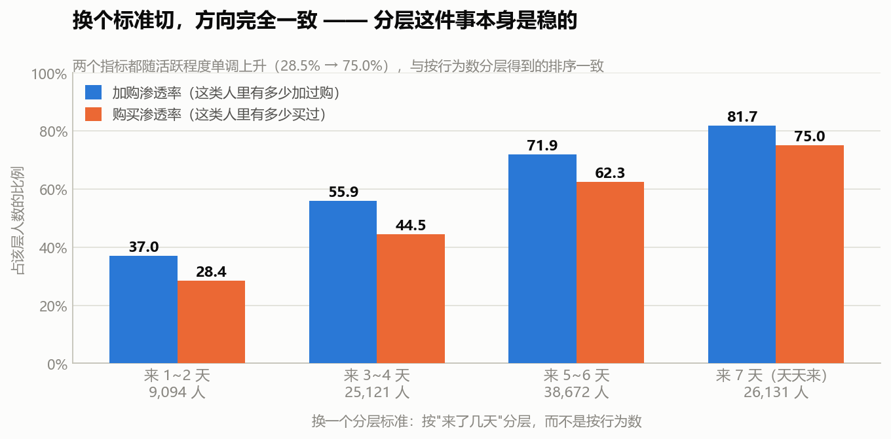

# S7 · 用户分层：活跃的人和买单的人，不是同一批

> 对应脚本：`sql/sql_07_segments.sql`（5 个结果集）
> 对应图：`output/charts/s7_contribution.png`、`s7_robustness.png`

到这一步，前六节已经把这个平台的用户画像拼得差不多了：逛多买少、购物车是比价清单、几乎天天来、回购不买同一件、类目差异巨大。

这一节换个切法：**能不能把用户按活跃程度分成几层？运营资源该押在哪一层？**

我本来以为这会是一个常规的分层分析——毕竟上一个 RFM 项目里，"少数人贡献多数营收"是核心结论。**结果这一节最值钱的地方，恰恰是这个结论没有迁移过来。**

---

## 1. 怎么分层：三分位，以及一个必须交代的平局问题

**分层依据：每个用户在观察窗内的行为记录总数**（不用金额——这份数据没有金额字段）。

切法是**三分位**（各层人数尽量均等），不是拍脑袋定阈值。

| 切分点 | 值 |
|---|---|
| 三分之一分位点 | **32** |
| 三分之二分位点 | **80** |

结果：

| 分层 | 人数 | 行为数下限 | 行为数上限 | 人均行为数 |
|---|---|---|---|---|
| 1 轻度 | 33,738 | 1 | 32 | 16.9 |
| 2 中度 | 32,585 | 33 | 80 | 53.6 |
| 3 重度 | 32,695 | 81 | 662 | 151.2 |

### 两个必须交代的细节

**第一，切分点撞上了平局。**

两个分位点都是整数（32 和 80），意味着**有大量用户的行为数正好是 32 或 80**。分位数落在一堆相同的值上，就不能把人群切成完全相等的三份。

实际结果：最大一层 33,738 人，最小一层 32,585 人，**相差 3.5%**。

> 这是我在 RFM 项目里踩过的坑——用 `qcut` 按金额分箱时，大量用户金额相同会导致分箱边界报错或分层严重不均。**这次的偏差只有 3.5%，不影响任何结论**，但必须写出来：**不交代分层是否均匀，等于隐瞒了分层方法可能失效这件事。**

**第二，有 2 个用户不在任何一层里。**

三层加起来 99,018 人，而全体是 99,020 人。差的这 2 个用户，**在 11-25 ~ 12-01 这个观察窗里没有任何行为**——他们只在被剔除的 12-02 / 12-03 出现过。这和 S3 查到的"12-02 当天的活跃用户里只有 2 个是新面孔"正好对上。

---

## 2. 三层的画像

| 指标 | 轻度 | 中度 | 重度 |
|---|---|---|---|
| 人数 | 33,738 | 32,585 | 32,695 |
| 人均活跃天数 | 3.70 | 5.34 | 6.29 |
| 人均碰过的商品数 | 14.4 | 42.7 | 113.7 |
| **购买渗透率** | **40.20%** | **60.73%** | **73.77%** |
| 加购渗透率 | 46.55% | 72.15% | 83.58% |
| 收藏渗透率 | 19.08% | 35.30% | 50.12% |

方向很干净：**越活跃的人，碰过的商品越多，买过的比例也越高。** 购买渗透率从 40.20% 一路升到 73.77%。

到这里都符合直觉。**但下面这张表是反的。**

| 分层 | 浏览占比 | 加购占比 | 收藏占比 | **购买占比** |
|---|---|---|---|---|
| 1 轻度 | 86.27% | 6.90% | 2.66% | **4.17%** |
| 2 中度 | 88.33% | 6.27% | 2.74% | **2.66%** |
| 3 重度 | **90.34%** | 5.05% | 3.00% | **1.61%** |

这是**每一层自己行为里的构成比例**。

**重度用户的行为里，只有 1.61% 是购买；轻度用户有 4.17%。** 越是重度用户，浏览占的比重越高（86.27% → 90.34%），购买占的比重越低。

> **所以"重度用户"是"逛得多"的人，不是"买得多"的人。** 他们每天来，翻很多商品，但真正下单的比例反而更低。
>
> 这已经预告了下一小节的结论。

---

## 3. 核心发现：行为量的集中度，远高于购买量的集中度

看三层各自贡献了多少：

| 分层 | 人数占比 | 行为量占比 | 购买量占比 | 加购量占比 | 卖出商品数占比 |
|---|---|---|---|---|---|
| 1 轻度 | 34.07% | **7.84%** | **15.84%** | 9.86% | 16.96% |
| 2 中度 | 32.91% | 24.04% | 31.05% | 27.45% | 31.62% |
| 3 重度 | 33.02% | **68.12%** | **53.11%** | 62.70% | 51.42% |

**重度用户（约三分之一的人）拿走了 68.12% 的行为量，却只产出 53.11% 的购买量。**

行为量的分布是 7.8 / 24.0 / 68.1——极度向头部集中。购买量的分布是 15.8 / 31.1 / 53.1——**集中度明显低得多**。

把它做成一个比率就更清楚了：

| 分层 | 购买量占比 ÷ 行为量占比 | 含义 |
|---|---|---|
| 1 轻度 | **2.02** | 每一份行为，产出 2 份购买份额 |
| 2 中度 | 1.29 | 略高于正比 |
| 3 重度 | **0.78** | 每一份行为，产出不到 1 份购买份额 |
| 1.0 | — | 产出与行为量成正比（基准线） |

> **轻度用户的"单位行为购买产出"是重度用户的 2.6 倍**（2.02 ÷ 0.78 = 2.59）。
>
> **换句话说：重度用户贡献了 68% 的流量，但只贡献了 53% 的成交。他们更多地"在逛"，而不是更多地"在买"。**

### 这里有一件我差点写错的事

我本来准备写："**这个结果和 RFM 项目里的'VIP 29% 的人贡献 75% 营收'正好相反。"**

**这句话是错的，两个数不能直接比。**

原因是口径：

| | RFM 项目 | 本节 |
|---|---|---|
| 统计对象 | **金额**（营收） | **笔数**（购买事件数） |
| 单位 | 元 | 次 |

**金额的集中度天然高于笔数的集中度。** 因为高价值客户不只是"买得多"，他们还"买得贵"——两个效应叠加，金额集中度自然比笔数集中度更极端。

所以严格说，我不能断言"行为数据上的集中度更低"。我能说的只有：

> **在"笔数"这个口径下，购买量的集中度是 53.1%（重度用户占比），而不是 75%。而且行为量的集中度（68.1%）显著高于购买量的集中度。**

**这个修正很重要。** 跨项目对比之前，必须先对齐口径——不然很容易得出一个听起来很有冲击力、但其实是"苹果比橘子"的结论。

> 这也是这一节我最想记下来的一条：**不要因为"我上个项目算出过 X"，就期待这个项目也能算出 X。** 上一个项目的结论是**这个项目的先验假设**，不是**这个项目的答案**——而且往往正是那个先验，会让你在数据已经给出不同答案的时候，还硬把它读成 X。
>
> 这里我差点就这么做了。救回来的是"把两个数字的单位写下来"这个动作。

---

## 4. 换个分层标准，结论还站得住吗

前面按"行为记录总数"分层，隐含一个假设：**行为多 = 活跃**。但一个人可能一天来一次、每次做 100 个动作，也可能天天来、每次只做几个动作。

所以换一个标准：**按"来了几天"分层**（这直接对应 S4 的活跃天数）。

| 按活跃天数分层 | 人数 | 加购渗透率 | 购买渗透率 |
|---|---|---|---|
| 来 1~2 天 | 9,094 | 37.01% | **28.45%** |
| 来 3~4 天 | 25,121 | 55.85% | 44.45% |
| 来 5~6 天 | 38,672 | 71.87% | 62.34% |
| 来 7 天（天天来） | 26,131 | 81.71% | **75.03%** |

**两个指标都随活跃程度单调上升，方向和按行为数分层完全一致。**

> **所以"用户能按活跃程度分层"这件事本身是稳的**——不管用哪个指标切，排序都是同一个。
>
> 这是本项目第四次做稳健性检验（前三次：S2 的 SKU 放宽、S4 的分半留存、S6 的分半复现）。**换一个角度算，结论还成立，才敢下结论**——这已经成了这个项目的标准动作。

---

## 5. 对运营意味着什么

这一节给出的结论，其实推翻了"把资源押给重度用户"这个常识：

1. **重度用户不是"高价值用户"，是"高流量用户"。** 他们贡献了 68% 的行为量，但只贡献 53% 的购买量，单位行为的购买产出是轻度用户的一半不到。**把预算投给他们是"买流量"，不是"买成交"。**

2. **轻度用户被低估了。** 他们只占 7.84% 的行为量，却贡献了 15.84% 的购买量。人数占三分之一，样本不小，值得单独做策略。

3. **但要小心一个反向的解释**：轻度用户"购买产出高"，也可能是因为**他们本来就没怎么逛**——总共就 16.9 次行为，其中 4.17% 是购买，说明他们是**目标明确型**用户：来了就买，买完就走。这不是"价值高"，是**行为模式不同**。

> 所以这一节的结论应该表述成**行为模式差异**，而不是**价值高低**：
>
> **重度用户 = 逛型（来得多，买得相对少）；轻度用户 = 买型（来得少，来了就买）。**
>
> 这两类人要的是完全不同的东西：逛型用户需要的是**更短的决策路径**（帮他把"逛"变成"买"），买型用户需要的是**更高的回访频次**（他已经证明了自己会买，只是来得少）。

---

## 6. 一句人话结论

按行为量把用户分成三层后，**重度用户拿走了 68.12% 的行为量，却只产出 53.11% 的购买量**；轻度用户的"单位行为购买产出"是重度的 2.6 倍（2.02 对 0.78）。**越活跃的人，行为里购买占的比例越低（4.17% → 1.61%）。** 所以在这份数据里，**"活跃"和"买单"是两件事**——重度用户是逛型，轻度用户是买型。

---

## 7. 面试可以这么说

> "这一步我按行为量做了三分位分层，切出轻中重三层各约三分之一。分位点落在 32 和 80，正好都在一堆相同值上，所以三层人数差了 3.5%，没有严格等分——这个我写进文档了，不交代分层是否均匀等于隐瞒了方法可能失效。
>
> 三层的购买渗透率是单调的：40.2% → 60.7% → 73.8%，越活跃买过的比例越高，符合直觉。**但我又看了一眼每层自己行为里的构成比例，发现是反的**：轻度用户的行为里 4.17% 是购买，重度只有 1.61%。**也就是说重度用户是'逛得多'，不是'买得多'。**
>
> 顺着这个看贡献份额，结论就清楚了：**重度用户拿走 68.1% 的行为量，只产出 53.1% 的购买量**；轻度用户只占 7.8% 的行为量，却贡献 15.8% 的购买量。做成比率，轻度用户的单位行为购买产出是 2.02，重度是 0.78，差 2.6 倍。
>
> **这里我差点写错一个地方。** 我本来想写'这和上一个 RFM 项目里 VIP 29% 贡献 75% 营收正好相反'——但这两个数不能比。RFM 那个是**金额**份额，我这里是**笔数**份额，金额的集中度天然比笔数高，因为高价值客户不只是买得多，还买得贵。**跨项目对比之前必须先对齐口径**，不然会得出一个听着有冲击力、其实是苹果比橘子的结论。
>
> 最后我做了稳健性检验，换成按'来了几天'分层，两个指标的排序完全一致——所以分层这件事本身是稳的。
>
> 这一节的结论我表述成**行为模式差异**而不是价值高低：**重度用户是逛型，轻度用户是买型**。逛型要的是更短的决策路径，买型要的是更高的回访频次，这两类人的策略方向是相反的。"

---

## 8. 局限

- **分层依据是"观察窗内的行为量"，不是全生命周期。** 窗口只有 7 天（已剔除异常的 12-02/12-03），所以"重度用户"只是**这 7 天里来得勤的人**，不代表长期高活跃。
- **三层人数不完全相等（相差 3.5%）。** 分位点（32、80）落在大量相同的值上，无法严格等分。偏差很小，但必须交代。
- **有 2 个用户不属于任何一层**（99,018 对 99,020），因为他们只在被剔除的 12-02/12-03 有行为。
- **第 3 小节的贡献份额不能和 RFM 项目的金额集中度直接比较。** 一个是笔数口径，一个是金额口径，金额集中度天然更高。本节的比较一律在笔数口径内部进行。
- **"轻度用户购买产出高"存在另一种解释**：他们行为少，可能只是"目标明确、买完就走"，不是"价值更高"。本节据此把结论表述为行为模式差异，而非价值高低。
- **购买渗透率普遍偏高**（受 S1 的筛选影响），只能做层间横向比较，不能与真实业务对标。
- **没有做因果推断。** "重度用户购买占比低"是描述性观察，不能反过来说"让他少逛就能提高购买率"。
