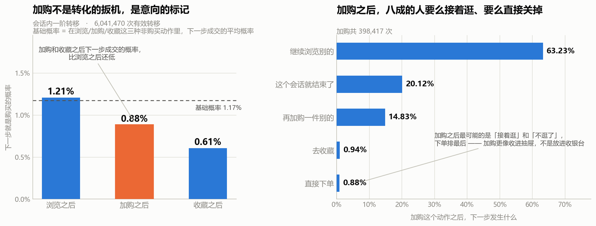
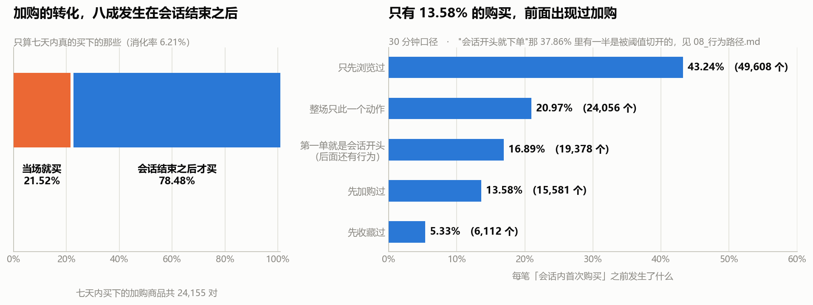

# S8 · 行为路径：加购不是扳机，是意向的标记

> 对应脚本：`sql/sql_08_paths.sql`（7 个结果集）、`code/08_build_sessions.py`（会话切分）、
> `code/08b_robustness.py` / `08c_transitions.py` / `08d_buy_position.py`（三项补充检验）
> 对应图：`output/charts/s8_session_depth.png`、`s8_transition.png`、`s8_cart_afterlife.png`

前面七节看的都是**汇总层面**的数：多少人浏览、多少人加购、留存几成、类目差多少倍。

这一节换到**事件流层面**：把每个用户的行为按时间串起来，还原出"一次逛"的完整过程，然后问一个前面几节都回答不了的问题——

> **逛的过程中，做到哪一步的人会买？加购之后那一下，到底发生了什么？**

**结论和前面七节攒下来的直觉是反的。** 这也是整个项目里我自己推翻自己最狠的一节。

---

## 1. 先交代口径：会话是我造的，不是数据给的

**这份数据里没有会话 ID。**

原始表只有五列：用户、商品、类目、行为、时间戳。没有任何字段告诉你"这几条行为属于同一次访问"。

所以在分析之前，必须先**自己造一个会话的定义**：

> **同一个用户，相邻两条行为的时间间隔超过 30 分钟，就算新开了一个会话。**

30 分钟是电商行业的惯例阈值，但必须说清楚：**它是我定的，不是数据给的。**

> **一个自己定义的口径，如果不去检验它，它就会变成整个分析里最脆弱的那一环。**
>
> 所以这一节专门安排了结果7 和一项补充检验：把阈值换成 15 分钟和 60 分钟各算一遍，看结论会不会翻盘。**如果不做这个检验，下面所有的数都只是"在某个特定阈值下成立"。**

还有两个必须交代的处理：

- **排序键固定为 `(时间戳, 商品, 行为)`。** 时间戳只精确到秒，同一秒内会有多条行为。如果只按时间戳排序，同一份数据跑两次，会话内部的行为顺序可能不一样——**那"行为路径"这个词就成了随机数。** 加上后两级排序键才能保证可复现。
- **观察窗截到 12-01。** 12-02 和 12-03 是 S3 查实的数据异常日（活跃覆盖率从 72~75% 跳到 98%），已剔除。

会话切分算一次不便宜（726 万行要按用户排序 + 跑窗口函数），所以**先物化成一个 parquet 表**（`code/08_build_sessions.py`），后面每个查询直接读，避免同一个窗口在每个结果集里重算一遍。

**中间踩了一个性能坑，记在这里：** 频率最高的会话序列那一问，第一版写成了"先把所有会话的行为拼成字符串、再筛长度"，120 万组 × 726 万行跑了 5 分钟都出不来。改成**先用会话长度把行数筛下来（只剩 21 万个会话）再聚合**，2.7 秒出结果。**在 SQL 里，"先聚合再筛"和"先筛再聚合"经常差上百倍。**

---

## 2. 一次"逛"长什么样

| 指标 | 值 |
|---|---|
| 会话总数 | 1,217,569 |
| 有会话的用户数 | 99,018 |
| 人均会话数 | 12.3 |
| 平均每会话行为数 | 5.96 |
| 会话行为数中位数 | **3** |
| 平均会话时长 | 11.57 分钟 |
| 会话时长中位数 | **3.42 分钟** |

会话长度的分布极度偏斜：

| 一个会话里有几个行为 | 会话数 | 占比 |
|---|---|---|
| 1 | **378,557** | **31.09%** |
| 2~3 | 298,331 | 24.50% |
| 4~10 | 348,643 | 28.63% |
| 11~30 | 164,672 | 13.52% |
| 31~100 | 26,878 | 2.21% |
| 100 以上 | 488 | 0.04% |

**近三分之一（31.09%）的会话只有一个行为**，中位数只有 3 个行为、3.42 分钟。平均数是 5.96 和 11.57 分钟——**被少数超长会话拉高了，中位数才是大多数人的体验。**

> 这也是本项目里第三次遇到同一件事：**平均数和"大多数人"不是一回事。** 前两次是 S1 的"68% 用户有购买行为"（样本被筛选过，平均数失真）和 S5 的"购买记录数 vs 购买天数"（口径不同，结论差 13.73 个点）。

---

## 3. 三分之二的会话，逛完什么意向动作都没留下

把会话按长度分成五档，看每一档里有多少会话产生了意向动作（加购 / 收藏）或成交：

| 会话行为数 | 会话数 | **纯浏览，无任何意向动作** | 含加购 | 至少有加购或收藏 | 含购买 |
|---|---|---|---|---|---|
| 1 | 378,557 | **83.84%** | 6.57% | 9.81% | 6.35% |
| 2~3 | 298,331 | 76.15% | 12.59% | 17.98% | 6.63% |
| 4~10 | 348,643 | 57.98% | 24.65% | 34.63% | 10.64% |
| 11~30 | 164,672 | 34.61% | 42.38% | 58.24% | 16.29% |
| 31 以上 | 27,366 | **16.11%** | 58.43% | 78.18% | 25.54% |

**加权汇总：全部 1,217,569 个会话里，66.37% 是纯浏览——没有加购、没有收藏、没有购买，什么都没有。**

### 但"会话越长越容易成交"这句话要先打个折

表里右边两列是单调上升的（含购买从 6.35% 涨到 25.54%），看起来像"逛得越久越容易买"。

**这个关系不能当发现讲。** 会话越长 = 行为越多 = **撞上购买的机会本来就越多**，这是构造决定的。就像说"买彩票张数多的人中奖率高"——是对的，但没有信息量。

> 我把它写进图里当反面教材了：**看到一个单调关系，先问一句"这个方向是不是被定义推出来的"。**

### 真正算数的是这一列：纯浏览占比，且它不怕换阈值

左边那列（纯浏览）从 83.84% 掉到 16.11%，**它不依赖任何"机会数"的机制**——一个会话要么留下了意向动作，要么没有。而它的整体水平（66.37%）经得起换阈值：

| 会话阈值 | 会话数 | 平均每会话行为数 | 单行为会话占比 | **纯浏览会话占比** |
|---|---|---|---|---|
| 15 分钟 | 1,381,399 | 5.25 | 33.94% | **68.53%** |
| **30 分钟（主口径）** | 1,217,569 | 5.96 | 31.09% | **66.37%** |
| 60 分钟 | 1,075,959 | 6.75 | 28.33% | **64.09%** |

**把阈值从 15 分钟一路放宽到 60 分钟——也就是把同一个人一小时内所有的行为尽量并成一个会话——纯浏览占比只从 68.53% 挪到 64.09%，差 4.44 个点，没有翻盘。**

> **所以"大部分会话是纯浏览"这件事是数据本身的性质，不是我把阈值切太碎切出来的。**（这是本项目第五次稳健性检验，前四次：S2 的 SKU 放宽、S4 的分半留存、S6 的分半复现、S7 的换分层标准。）

最常见的会话序列也印证这一点。长度 4~6 的会话里，排名前三的序列是：

| 行为序列 | 序列长度 | 出现会话数 | 占同长度会话比例 |
|---|---|---|---|
| `pppp` | 4 | 59,075 | **66.86%** |
| `ppppp` | 5 | 42,310 | **61.55%** |
| `pppppp` | 6 | 31,777 | **58.23%** |

（`p`=浏览、`c`=加购、`f`=收藏、`b`=购买。**序列里的第 4 名只有 3,295 个会话，和第 1 名差了 18 倍**——纯浏览会话不只是最多的，是碾压式的最多。）

> **这里有一个我第一版算错、复查时删掉的东西。** 第一版我在这张表里加了一列"该序列的成交率"，跑出来全是 0% 或者 100%。
>
> 原因：一个序列里只要含 `b`，成交率就是 100%；不含就是 0%。**它不是转化率，是"这个序列包不包含 b"的恒等式。** 分组变量（序列）和结果变量（含不含购买）在构造上重叠了——和 S5 那张"回购用户特征表"是同一类错误（那次的变量是"买了同款"和"回购"，也是同一份数据推出来的两个数）。**所以这次直接不产出这个数。**

---

## 4. 核心发现：加购之后的下一步，最不可能是购买

前面 S2 说过"一旦加购，回返率高"。那是**七天窗口**的口径——**在七天内买回自己加购过商品的人占 31.13%**。

这一节换成完全不同的问法：

> **在会话里，站在"加购"这个动作上，下一个动作是购买的概率是多少？**

统计了 604 万次有效的会话内一阶转移：

| 当前动作 | 出现次数 | 下一步浏览 | 下一步加购 | 下一步收藏 | **下一步购买** | 会话结束 |
|---|---|---|---|---|---|---|
| 浏览 | 6,499,835 | 76.78% | 3.97% | 2.02% | **1.21%** | 16.02% |
| 加购 | 398,417 | 63.23% | 14.83% | 0.94% | **0.88%** | 20.12% |
| 收藏 | 211,156 | 63.82% | 1.78% | 17.11% | **0.61%** | 16.69% |
| 购买 | 149,631 | 40.29% | 2.61% | 1.15% | **15.28%** | 40.68% |

**基础概率**（在浏览/加购/收藏这三种"非购买"动作里，下一步成交的平均概率）= **1.17%**。

**加购之后下一步就买的概率是 0.88%——比浏览之后的 1.21% 还低，也低于基础概率 1.17%。**

> **加购和收藏，是这张表里"下一步成交概率"最低的两个动作。**
>
> 换句话说：**你站在一个刚加购的人面前，他下一步下单的概率，比你随便抓一个正在浏览的人还低。**

为什么？看右图——加购之后的下一步到底干嘛去了：

| 加购之后下一步 | 占比 |
|---|---|
| 继续浏览别的 | **63.23%** |
| 这个会话就结束了 | **20.12%** |
| 再加购一件别的 | 14.83% |
| 去收藏 | 0.94% |
| **直接下单** | **0.88%** |

**加购之后最常见的是"接着逛"（63.23%）和"不逛了"（20.12%），加起来八成三。** 下单排最后。

还有两个细节值得记：

- **加购 → 再加购一件别的有 14.83%**，是"非浏览"里最高的一项。用户在**连续往购物车里放东西**，而不是**推着购物车去结账**。
- **收藏 → 加购只有 1.78%，加购 → 收藏只有 0.94%。** 这两个动作基本是两条平行路径，不互相转换。

> **所以加购在这份数据里的角色，接近"收藏夹"，而不是"收银台"。**
>
> 它不是转化的扳机，是**意向的标记**——它标记了一个"我考虑过"的状态，但这个状态本身不推动下一步动作。

### 这和 S2 的结论矛盾吗？不矛盾，是两个不同的问法

| | S2 的问题 | S8 的问题 |
|---|---|---|
| 问法 | 加过购的人，**七天内**有多少买了他加购的东西？ | 加购这个动作的**下一步**，是购买的概率多大？ |
| 口径 | 人 × 商品，跨会话，七天窗口 | 动作 × 动作，会话内，相邻 |
| 结果 | 31.13%（人数口径）/ 6.21%（商品项口径） | **0.88%** |

**两个都成立。** 加购和"最终会买"确实相关（S2 的 6.21% 远高于随便一个商品的成交率）——但**加购和"马上会买"负相关**。

> 这两个数字放在一起才是完整的：**加购标记的是"这个人有兴趣"，不是"这笔单快成了"。**
>
> **把它们混为一谈，就会得出"加购是转化漏斗的最后一环、应该加大力度推动加购"这种结论——而数据显示加购之后的即时转化率是所有动作里最低的。**

---

## 5. 那加购的转化到底发生在什么时候

顺着上面那个问题往下查：**七天内被买下的加购商品，是在加购的当场买的，还是之后才买的？**

| 口径 | 对数 | 消化率 |
|---|---|---|
| 单会话内（人, 会话, 商品） | 395,887 | **1.38%** |
| 全窗口（人, 商品，七天） | 389,170 | **6.21%** |

在七天内真的被买下的 24,155 对加购商品里：

| 时间归属 | 对数 | 占比 |
|---|---|---|
| **当场就买**（同一会话内） | 5,198 | **21.52%** |
| **会话结束之后才买** | 18,957 | **78.48%** |

**加购带来的成交，将近八成发生在这次会话结束之后。**

> 这一条直接改变了加购这个指标的用法：**如果拿"加购当天的成交率"去考核运营动作，会系统性低估加购的价值——因为四分之三的效果在当天根本还没发生。**
>
> 反过来，如果拿"七天成交率"去评估，又会高估"加购之后立刻推一把"的空间——**真正该做的是"把加购商品在后面的会话里重新送到他面前"，而不是"在他加购的那一刻催他下单"。** 这正是 S9 要做的事。

---

## 6. 购买之前发生了什么：两个我算错又改回来的地方

最后一个问题：**会话里的第一笔购买，之前那一步是什么？**

| 第一单之前发生了什么 | 会话数 | 占比 |
|---|---|---|
| 只先浏览过 | 49,608 | **43.24%** |
| 整场只此一个动作（进来就买，只有这一下） | 24,056 | 20.97% |
| 第一单就是会话开头（后面还有行为） | 19,378 | 16.89% |
| **先加购过** | 15,581 | **13.58%** |
| 先收藏过 | 6,112 | 5.33% |

**只有 13.58% 的购买，前面出现过加购。** 这和上一节的结论是一致的：加购是意向标记，不是转化的必经环节。

### 错误一：CASE 少写了一类，16.89% 掉进了"其它"

第一版跑出来，"其它"那一档有 16.89%——**太大了，不可能真的是"其它"。**

我去查了具体的会话，发现是这样一种情况：`买 → 浏览 → 浏览`。**购买是这个会话的第一个动作，但会话本身不止一个动作。** 而我的 `CASE` 写的是"如果会话长度是 1 就算直接下单"，于是这类会话既不满足"长度 1"，也找不到"购买之前的行为"（因为确实没有），全部掉进了兜底分支。

**修法是把判断条件从"会话长度"改成"购买之前有没有行为"**，这样 `买 → 浏览` 和 `买`（单独一个动作）就被正确分开了。

> **教训：兜底分支（`ELSE '其它'`）的比例一旦超过 5%，就不该继续往下走。** 一个设计良好的分类里，"其它"应该是零头。它变大了，说明分类方案本身和数据的形态对不上。

### 错误二："进来直接下单"里，有一半是阈值切出来的假象

看表里第二、三行：**20.97% + 16.89% = 37.86% 的购买，前面一个行为都没有。**

这个数字很可疑。它和"用户会先逛再买"的常识冲突。**我怀疑它不是行为特征，是会话切分切出来的：一个人 10:00 浏览、10:45 下单，间隔超过 30 分钟被切成两个会话，下单那个自然显得"进来就买"。**

验证方法是**换阈值**：

| 会话阈值 | "第一单是会话开头"的占比 |
|---|---|
| 15 分钟 | 43.81% |
| **30 分钟（主口径）** | **37.86%** |
| 60 分钟 | **33.49%** |

**阈值一放宽，占比就往下掉——确实是切分切出来的。**

但**它没有掉到零**。60 分钟口径下还剩 33.49%。于是一路追下去：

- 60 分钟口径下，"第一单是会话开头"的有 **37,549** 个
- 其中 **19,789 个（52.70%）当天更早还活动过**——只是中间隔了一个多小时，被切到别的会话里去了
- 剩下的 **17,760 个（占该口径全部首单的 15.84%）**，当天更早完全没有活动过

> **最终落点：大约六分之一的购买，是"打开就直接买"，在此之前一整天都没在这个平台上出现过。**
>
> 这类购买大概率是**再次购买、从购物车直接结算、或者从推送/短信直达商品页**——但**这份数据里没有入口来源字段，我无法区分是哪一种，所以不猜。**
>
> 能说的是：**它是一个真实存在的、占比 15.84% 的行为模式，而不是切分假象。** 剩下的 84.16%，前面都有浏览行为。

---

## 7. 一句人话结论

把行为按时间串成"会话"之后，**66.37% 的会话是纯浏览——没有加购、没有收藏、没有购买**（换 15/60 分钟阈值结论不变，68.53% → 64.09%）。而最关键的一条是：**加购之后下一步就购买的概率只有 0.88%，比浏览之后的 1.21% 还低，比"随便一个动作之后成交"的基础概率 1.17% 也更低。** 加购之后最可能发生的是接着逛（63.23%）或者直接关掉（20.12%）。**加购不是转化的扳机，是意向的标记**——它标记"有兴趣"，但不推动下一步。与之配套的是：**加购带来的成交，78.48% 发生在会话结束之后**，只有 21.52% 是当场买的。

---

## 8. 面试可以这么说

> "这一步是把行为还原成'一次逛'的过程。**但这份数据里没有会话 ID**，所以我必须自己定义一个——同一个人相邻两条行为间隔超过 30 分钟算新会话。**关键是：这个 30 分钟是我定的，不是数据给的，所以我必须检验它。** 我换成 15 分钟和 60 分钟各跑了一遍。
>
> 先说最稳的一个数：**66.37% 的会话是纯浏览，什么意向动作都没有。** 换阈值 15→60 分钟，这个数从 68.53% 到 64.09%，只挪了 4.4 个点——**说明它是数据本身的性质，不是我阈值切太碎切出来的。**
>
> 但真正让我改了看法的是转移概率。我统计了 604 万次会话内的行为转移，问：**站在'加购'这个动作上，下一步是购买的概率有多大？答案是 0.88%。而站在'浏览'上是 1.21%，随机一个非购买动作的平均是 1.17%。**
>
> **也就是说，加购之后下一步就买的概率，比随便抓一个正在浏览的人还低。** 那加购之后在干嘛？63% 接着逛，20% 直接关掉，下单排最后。
>
> 这和我前面 S2 的结论看起来是矛盾的——S2 我说过'一旦加购回返率高'，七天内买回加购商品的人有 31%。**但两个问法不一样**：S2 问的是'加过购的人七天内会不会买回来'，这里问的是'加购这个动作的下一步是不是购买'。**两个都成立**：加购标记的是'有兴趣'，不是'快成交了'。把这两个混起来，就会得出'加购是漏斗最后一环、要加大力度促加购'这种结论——而数据显示加购之后的即时转化率是所有动作里最低的。
>
> 顺着查下去，加购带来的成交里，**78.48% 发生在会话结束之后**，只有 21.52% 是当场买的。**所以拿'加购当天成交率'考核运营会严重低估加购的价值，因为它四分之三的效果当天还没发生。**
>
> 最后一步的购买路径上我犯了两个错，都改回来了。**第一个**，我算过一列'序列成交率'，跑出来全是 0% 或 100%——因为序列里含不含'购买'这个字是构造决定的，它不是转化率，是恒等式，和 S5 那张回购特征表是同一类错误，所以我把这一列删了。**第二个**，我算出来 37.86% 的购买是'进来直接下单'，看着像重大发现，我怀疑是阈值切出来的，换阈值一验，从 43.81% 掉到 33.49%，确实是切分假象。**但没掉到零**，我又往下追了一层，把'当天更早还活动过'的剔掉，最后落在 **15.84%**——**大约六分之一的购买是当天完全没来过、打开就买**。这个数我不解释原因，因为数据里没有入口来源字段，区分不了是复购、购物车结算还是推送直达。"

---

## 9. 局限

- **会话是我自己定义的，不是数据给的。** 30 分钟是行业惯例，但这个项目里它是我拍的板。已用 15/60 分钟做过稳健性检验（纯浏览占比 68.53% / 66.37% / 64.09%），主要结论不依赖阈值，但**具体的会话数、人均会话数这些规模指标是阈值相关的**，不能当成固定事实。
- **观察窗只有 7 天，窗口最后的那次会话一定被切断。** 这会系统性低估长会话、低估会话内转化率。S8 的所有会话内指标都受这个影响，且**无法修正**——只能声明方向。
- **"会话越长越容易成交"是机制性关系，不是发现。** 行为多 = 触碰购买的机会多。本节只把"纯浏览占比"当作结论，因为那一列不依赖机会数。
- **"加购之后下一步成交 0.88%"是即时转化口径，不等于加购的长期价值。** 全窗口口径是 6.21%（商品项）/ 31.13%（人数）。**这两个数必须成对出现，单独引用任何一个都会误导。**
- **结果5 只保留长度 4~6 的会话序列。** 长度 1~3 的会话序列种类太少（`p`、`pp`、`ppp`）没有信息量，长度 7 以上的组合数爆炸、头部占比已经很低。**这张表是"最常见的模式"，不是"全部路径的分布"。**
- **"购买之前发生了什么"只统计会话内的第一个购买。** 会话长度只有 1 时（占 20.97%）"之前"这一栏是空的，不能解释成"没有浏览就买了"——它也可能是"上次会话浏览过、这次进来直接买"。这部分在 6.2 小节单独追过，落在 15.84%。
- **15.84% 这个数只说明"当天没有其他行为"，不说明入口来源。** 数据里没有来源字段，区分不了复购、购物车结算、推送直达，所以不做归因。
- **没有做因果推断。** "加购之后成交率低"是描述性观察。**不能反过来说"别让用户加购"或者"加购害了转化"**——加购的人本来就和没加购的人不是同一批人（他们在认真考虑商品），这是选择效应，不是因果。
- **会话切分没有考虑跨设备、跨 App 的场景。** 同一个人的行为可能被记成不同格式，但这份数据只有一个 user_id 维度，无法识别。
