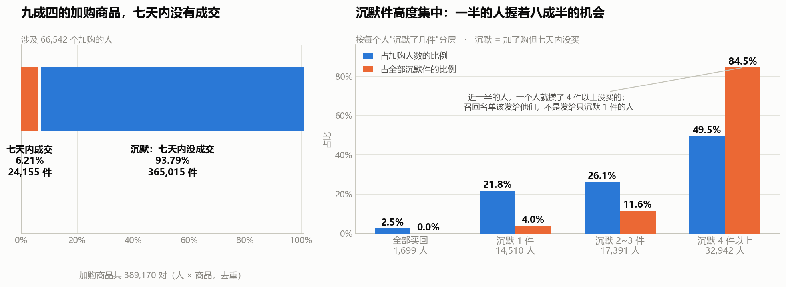
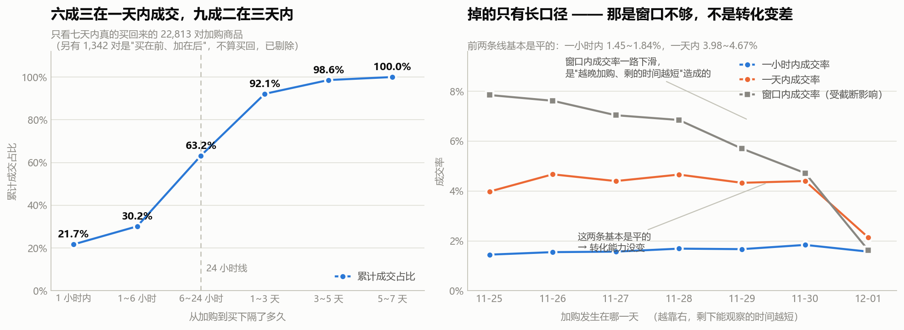

# S9 · 加购召回：盘子有多大，什么时候打

> 对应脚本：`sql/sql_09_recall.sql`（6 个结果集）
> 对应图：`output/charts/s9_recall_pool.png`、`s9_recall_timing.png`

S8 查出来一件事：**加购带来的成交，78.48% 发生在会话结束之后**，当场成交只有 21.52%。加购不是转化的扳机，是意向的标记。

那顺着往下就是运营问题了：

> **那些加了购物车却没买的人，值不值得捞？捞得回来多少？如果要捞，该在什么时候打？**

这一节要给出一个**能拿去开会讨论**的答案。

---

## 0. 先立一条纪律：这一节不给金额

**这份数据没有金额字段。** 只有用户、商品、类目、行为、时间戳五列。

所以这一节的所有测算**只用"件数"和"人数"**。我不会写"能带来多少 GMV"，也不会乘客单价。

**没有金额字段却给出"预计增收 XXX 万元"，是这类项目里最常见、也最容易被面试官一句话问穿的地方。** 面试官只要问一句"客单价哪来的"，整个测算就塌了。

> **这一节的产出边界是：能多成交多少件、能触达多少人。到"值多少钱"为止，我不往下走——因为没有输入。**

同理，**这一节也算不出 ROI**：券的成本、触达的成本、人力的成本，数据里一个都没有。**只有"收益件数"没有"成本"，ROI 就是一个编出来的数。**

---

## 1. 盘子有多大：九成四的加购商品，七天内没有成交

先把口径钉死：

- **一对** = 一个人 × 一个商品（去重）。同一个人同一件商品加购多次算一对。
- **买回** = 购买发生在**加购之后**。买在前、加在后**不算**买回（下面第 3 节会用到这个区别）。
- 窗口 = 11-25 ~ 12-01（7 天，已剔除异常的 12-02/12-03）。

| 指标 | 值 |
|---|---|
| 加购商品对 | **389,170** |
| 七天内买下的 | 24,155（**6.21%**） |
| **沉默加购对** | **365,015（93.79%）** |

从人这一侧看：

| 指标 | 值 |
|---|---|
| 加购人数 | 66,542 |
| 有沉默件的人数 | 64,843 |
| 至少买回一件的人数 | 16,896 |
| **全部买回的人数** | **1,699** |

> ⚠️ 中间两行**是重叠的**——一个人完全可以既有买回的件、又有沉默的件。**这两个数不能相加**，加起来会得到 81,739，比总人数 66,542 还多。
>
> 只有最后一行"全部买回"是从总数里减出来的（66,542 − 64,843 = 1,699），**那个才是不重叠的**。
>
> 这是我第一版把标签写成"一件都没买回的人数"时差点犯的错：**一个重叠的分类，两个分支加起来超过总数，就是一个必须立刻停下来检查的信号。**

**6.21% 这个数，和 S2 报的 6.47% 是同一件事**（S2 没剔除 12-02/12-03，所以分母更大）。两个数互相印证，差在窗口。

### 和 S2 的一个口径差异，必须说明

S2 报的**加购人数是 74,220**，这一节是 **66,542**。差的 7,678 人**只在 12-02/12-03 加过购**——那两天是 S3 查实的数据异常日，本节剔除了，S2 没有。

再加上本节"买回"要求购买在加购之后（S2 没有这个约束），所以：

| | S2 | S9 |
|---|---|---|
| 窗口 | 11-25 ~ 12-03 | 11-25 ~ 12-01 |
| 加购人数 | 74,220 | 66,542 |
| 买回人数 | 23,107 | 16,896 |
| 买回率 | 31.13% | 25.39% |

**这两个数不能互相印证，也不能同时引用。** 报哪个都行，但必须把窗口和口径一起报。

---

## 2. 盘子握在谁手里：一半的人握着八成半的机会

把 66,542 个加购的人按"沉默了几件"分成四层：

| 分层 | 人数 | 人数占比 | 沉默件数 | **沉默件数占比** |
|---|---|---|---|---|
| A 全部买回 | 1,699 | 2.55% | 0 | 0.00% |
| B 沉默 1 件 | 14,510 | 21.81% | 14,510 | 3.98% |
| C 沉默 2~3 件 | 17,391 | 26.14% | 42,172 | 11.55% |
| **D 沉默 4 件以上** | **32,942** | **49.51%** | **308,333** | **84.47%** |

**近一半的人（49.51%）一个人就攒了 4 件以上没买的，这批人握着 84.47% 的沉默件。**

> **这是本项目第三次遇到"头部集中"**——S7 是重度用户拿着 68% 的行为量，S6 是前 500 个类目占 74% 的浏览。
>
> 但这一次的用法不一样：**前两次是"发现一个结构"，这一次是"直接决定名单发给谁"。**
>
> 召回是有成本的（每一次触达都消耗用户耐心和权益预算）。**如果名单平均发给 66,542 个人，其中 21.81% 的人只沉默 1 件——为了捞一件商品去打扰一个人，不划算。** 把资源压在 D 层这 32,942 个人身上，覆盖面是一样的 **84.47%**，人数少了**一半**。

---

## 3. 什么时候打：六成三在一天内，九成二在三天内

只在**七天内真的买回来**的 22,813 对上加购商品上（比结果1 的 24,155 少 1,342 对，那 1,342 对是"买在前、加在后"，不算买回），看从加购到购买隔了多久：

| 加购到购买 | 对数 | 区间占比 | **累计占比** |
|---|---|---|---|
| 1 小时内 | 4,946 | 21.68% | **21.68%** |
| 1~6 小时 | 1,935 | 8.48% | 30.16% |
| 6~24 小时 | 7,547 | 33.08% | **63.24%** |
| 1~3 天 | 6,590 | 28.89% | **92.13%** |
| 3~5 天 | 1,476 | 6.47% | 98.60% |
| 5~7 天 | 319 | 1.40% | 100.00% |

**63.24% 在 24 小时内成交，92.13% 在 3 天内成交。**

注意 **6~24 小时这一档是最大的一块（33.08%）**，比"1 小时内"还大。这说明最常见的模式不是"马上下单"，也不是"过几天再说"，而是**"先放购物车，睡一觉或者过半天，再回来买"**。

> 这条直接决定了触达时点：**在加购当下催单，打到的是那 21.68%；真正的机会窗口是加购后的几小时到第二天。**
>
> 结合 S8 的发现（加购之后下一步成交概率所有动作里最低），**同一个结论从两条完全不同的路走出来了：加购的当场不是决策时刻，后面那段才是。**

### 但这个分布必须先过截断检验

上面那张表是把 7 个加购日混在一起算的。**越晚加购的人，能观察到的时间越短**——12-01 加购的人，最多只能观察到几小时。

所以按加购日拆开，同时看三个不同长度的口径：

| 加购日 | 加购对数 | 剩余可观察天数 | **一小时内成交率** | **一天内成交率** | **窗口内成交率** |
|---|---|---|---|---|---|
| 11-25 | 56,287 | 6 | 1.45% | 3.98% | **7.85%** |
| 11-26 | 57,622 | 5 | 1.55% | 4.67% | 7.62% |
| 11-27 | 52,923 | 4 | 1.57% | 4.40% | 7.04% |
| 11-28 | 52,747 | 3 | 1.69% | 4.66% | 6.85% |
| 11-29 | 53,931 | 2 | 1.67% | 4.33% | 5.70% |
| 11-30 | 55,075 | 1 | 1.84% | 4.40% | 4.72% |
| 12-01 | 60,585 | **0** | 1.57% | **2.14%** | **1.63%** |

**三个口径的表现完全不同，这就是截断检验的价值：**

- **一小时内成交率：1.45% ~ 1.84%，完全平稳。** 这个口径几乎不受窗口影响（只要加购日不是最后一天，一小时总是观察得到的），所以它是**最干净的一个数**。
- **一天内成交率：3.98% ~ 4.67%，也是平的**，只有 12-01 掉到 2.14%——因为那天加购的人在窗口结束前根本凑不满一天。
- **窗口内成交率：7.85% → 4.72%，单调下滑。** 这条线看起来像"越晚加购的人转化越差"，**但它其实是纯截断效应**——前面两条平线已经证明转化能力没变，变的只是"还剩多少时间能观察"。

> **所以真正的七天内成交率，应该看 11-25 那批人的 7.85%**——他们有 6 天可观察，最接近完整窗口。**不是 6.21% 那个混合值，更不是 12-01 的 1.63%。**
>
> **一条随时间下滑的曲线，如果同时有一条不随时间变化的短口径在，那下滑就是窗口造成的，不是业务变差。** 这是本项目里判断"截断"的通用手法（S5 用过一次，S9 这次做成了标准的三口径对照）。

---

## 4. 够得着吗：89.21% 的人，加购之后还会回来

盘子大、时点清楚，还有一个前提要验：**这些人还回得来吗？** 如果加购之后就再也没出现过，站内召回根本触达不到。

| 指标 | 值 |
|---|---|
| 加购人数 | 66,542 |
| **加购之后还回来过** | **59,361** |
| 站内可触达占比 | **89.21%** |

**接近九成的加购者，在最后一次加购之后还回到过站内。**

> ⚠️ **这是下界，不是准确值。** 条件是"最后一次加购之后还在站内出现过"，而窗口末端（12-01）加购的人**根本没时间回来**，被算进了"没回来"。真实比例只会比 89.21% 更高。
>
> 而且这个条件很松：加购之后隔一分钟再点一次也算"回来过"。**它回答的是"站内有没有机会触达"，不是"推了个提醒他会不会看"。**

**结论：站内召回在触达层面是可行的，不需要依赖站外渠道（短信、推送），也就不需要那部分成本。** 但这只证明了"能送到"，没证明"送了有用"——那要靠下一节的实验。

---

## 5. 机会量化：一张算术换算器，不是预测

| 情景 | 假设 | 多成交件数 | 提升后整体加购成交率 |
|---|---|---|---|
| 基准 | 不做任何召回 | 0 | **6.21%** |
| 保守 | 沉默组成交率 0 → 5% | **18,251** | 10.90% |
| 中性 | 0 → 10% | 36,502 | 15.59% |
| 乐观 | 0 → 20% | 73,003 | 24.97% |

**怎么读这张表：**

**第一，它是"如果……那么……"的换算，不是预测。**

那三个提升幅度（5 / 10 / 20 个百分点）**是我拍的，不是数据算出来的。** 这份数据里**没有实验、没有对照组**，我无法验证任何一个提升率。

它的唯一作用是回答一个更朴素的问题：**"每提升 1 个点的沉默加购转化，对应多少件成交？"答案是 3,650 件。** 把"召回有没有价值"从一句感觉变成一个可以坐下来谈的算术。

**第二，哪一档现实，有锚可以对照：**

- 沉默件当前的成交率是 **0%**（定义如此——它们之所以在"沉默"这一档，就是因为没有成交）
- 全部加购件当前的成交率是 **6.21%**
- 观察最充分的 11-25 批次，窗口内成交率是 **7.85%**

> 所以：**"保守"档 5% 相当于把沉默组从 0 拉到接近总体平均（6.21%）——这是个"够得着"的目标。**
>
> **"乐观"档 20% 是总体平均的三倍多，现实中基本达不到**，列出来只是为了说明上限在哪。
>
> **我把它列出来的原因，是为了让这张表不能被我一个人用好——任何看到这张表的人都能判断哪一档可信。**

**第三，要拿到真实提升率，只有一条路：做 A/B 实验。**

**这是这一节的结论，不是局限。** 一个数据分析报告最诚实的收尾，往往不是"建议加大投入"，而是"我算到了这里，剩下的需要一次实验"。

---

## 6. 一句人话结论

**389,170 对加购商品里，93.79%（365,015 对）七天内没有成交**，涉及 66,542 个人。这个盘子**够得着**——89.21% 的加购者加购之后还会回站内（这还是下界）。**时点是清楚的**：63.24% 的买回发生在 24 小时内、92.13% 在 3 天内，而且最容易出事的是"6~24 小时"这一档（33.08%）——**加购当下的催促只能打到两成，真正的窗口在几小时之后到第二天。** 资源该压在谁身上也是清楚的：**一半的人（32,942 个）握着 84.47% 的沉默件**，名单发给他们，覆盖面不变但人数少一半。**至于能提升多少——这份数据回答不了，它没有实验、没有金额，所以答案停在"件数"，下一步是 A/B 测试。**

---

## 7. 面试可以这么说

> "S8 我发现加购带来的成交有 78% 发生在会话结束之后，所以就顺着做了一步运营测算：这批沉默的加购，值不值得捞。
>
> **先说一条纪律：这份数据没有金额字段，所以整个测算我只用件数和人数，不给 GMV、也不给 ROI。** 因为客单价和成本数据里都没有——**没有金额字段却给出'预计增收多少万'，是这类项目最容易被一句话问穿的地方。**
>
> 盘子是：389,170 对加购商品，七天内只有 6.21% 成交，剩下的 93.79% 是沉默的，涉及 66,542 个人。**这里我先做了个人群拆分**——按每个人沉默了几件分四层，结果一半的人（49.51%）一个人就攒了 4 件以上没买的，**这 3 万人握着 84.47% 的沉默件**。**所以召回名单该发给他们，不是平均发给所有人——覆盖面一样，人数少一半。**
>
> **然后是时点**。我算了从加购到购买隔了多久：63% 在一天内，92% 在三天内。但这里有个陷阱——**越晚加购的人能观察的时间越短**，混在一起算会低估长间隔。所以我按加购日拆开，同时看三个口径：一小时内成交率 1.45 到 1.84，一天内 3.98 到 4.67，这两条都是**平的**；只有'窗口内成交率'从 7.85 一路掉到 4.72。**前面两条平线证明了转化能力没变，那长口径的下滑就纯粹是窗口不够造成的，不是业务变差。**
>
> 这个分布直接决定触达时点：**加购当下催只能打到 21.68%，最大的那一档反而是'6 到 24 小时'，占 33%。**
>
> 我还验了一个前提：这批人还回得来吗。**89.21% 的加购者加购之后还会回站内**——而且这是下界，因为窗口末端加购的人根本没时间回来。**所以站内召回在触达上是可行的，不需要站外渠道。**
>
> **最后是量化，这里我要说清楚一件事：我给的是一张算术换算器，不是预测。** 表格里写了三档，但我明确标了哪一档现实：**'保守'档 5% 相当于把沉默组拉到接近总体平均 6.21%，够得着；'乐观'档 20% 是总体平均的三倍多，基本达不到，列出来只是让人看到上限在哪。**
>
> **这几个提升幅度是我拍的，不是数据算出来的——这份数据没有实验、没有对照组，我验证不了任何一个。** 要拿到真实提升率只有一条路，做 A/B 测试。**这是这一节的结论，不是局限。**"

---

## 8. 局限

- **没有金额字段，所以只到"件数"和"人数"。** 不乘客单价、不给 GMV、不给 ROI。**客单价、券成本、触达成本、人力成本，数据里一个都没有。**
- **那三个提升幅度是假设，不是估计，更不是预测。** 5 / 10 / 20 个百分点是我拍的。**任何一档都不能当作结论引用**，它们的唯一作用是把"提升 1 个点 = 3,650 件"这个换算关系摆出来。
- **没有实验、没有对照组。** 沉默加购组的成交率是 0%（按定义），所以任何"提升"都是反事实，这份数据从原理上就验证不了。**要真数只有 A/B 测试一条路。**
- **观察窗只有 7 天，所以"沉默"是 7 天内的沉默。** 一件第 10 天才被买走的加购商品，在这份数据里永远算沉默。**真实的沉默比例一定比 93.79% 低**，但这份数据测不出低多少——这是截断，方向已知、幅度未知。
- **窗口末端的截断会同时低估两件事**：7 天成交率（6.21% 这个混合值偏低，干净参照是 11-25 批次的 7.85%）和可触达比例（89.21% 是下界）。
- **"89.21% 会回站内"只证明能触达，不证明触达有效。** 而且条件很松，加购后隔一分钟再点一次也算"回来过"。
- **本节"买回"的定义比 S2/S8 严格**（要求购买在加购之后），窗口也不同（剔除了 12-02/12-03）。所以 **S2 的 31.13% 和本节的 25.39% 不能互相印证，也不能同时引用。**
- **结果1 里"有沉默件的人数"和"至少买回一件的人数"是重叠的，不能相加。** 只有"全部买回的人数"是不重叠的。
- **没有做因果推断。** "加购的人沉默率高"不等于"加购导致了沉默"。**加购的人本来就和没加购的人不是一批人**——他们在认真考虑商品，决策周期天然更长。这是选择效应。
- **召回名单用的是"沉默件数"这一个维度。** 真实业务里还要考虑商品价值、类目、时效、用户疲劳度，本节没有金额也没有成本，做不到完整排序。
