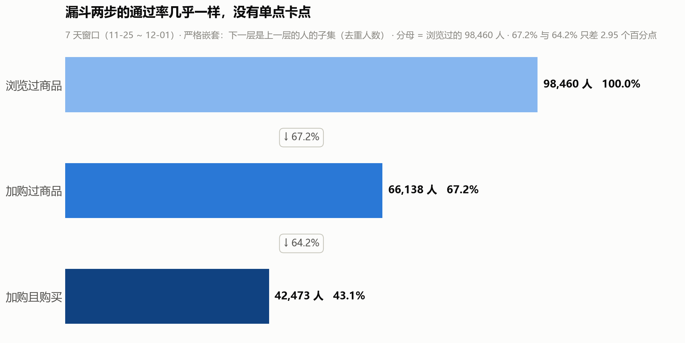
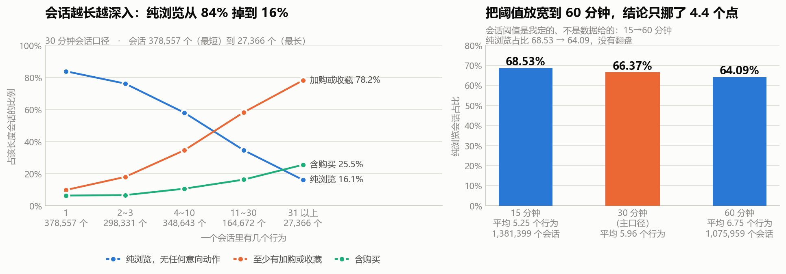

# 淘宝用户行为漏斗分析 · 项目复盘

> **一句话**：用 1000 万条淘宝用户行为日志，把「逛 → 加购 → 买」这条路上的每一步查清楚，
> 并推翻三条听起来很对、但数据不支持的常识。

---

## 一、项目概况

| 项目 | 内容 |
|---|---|
| 数据来源 | Kaggle「User Behavior Data from Taobao」（阿里天池同源） |
| 数据规模 | 原始 1 亿行（3.67 GB）；分析用样本 1000 万行 |
| 覆盖时间 | 2017-11-25 ~ 2017-12-01（7 天分析窗口） |
| 分析对象 | 样本 99,020 个用户（9 天建库窗口）；商品 158.8 万件、类目 8,044 个 |
| 主要工具 | DuckDB + SQL（取数）、Python + Matplotlib（画图） |
| 产出 | 9 组 SQL、20 张结论图、10 篇分析文档、4 张 Tableau 聚合表 |
| 项目定位 | 通用数据分析能力（漏斗 / 留存 / 分层 / 行为序列） |

---

## 二、数据说明

原始表只有 5 列，**没有表头**，逗号分隔：

| 列 | 含义 |
|---|---|
| `user_id` | 用户 ID（已脱敏） |
| `item_id` | 商品 ID |
| `category_id` | 类目 ID（脱敏编号，**没有类目名称**） |
| `behavior` | 行为类型：`pv` 浏览 / `fav` 收藏 / `cart` 加购 / `buy` 购买 |
| `timestamp` | 事件时间（Unix 秒，已换算北京时间） |

**四个必须提前知道的处理：**

1. **按用户抽样，不是按行抽。** 用 `hash(user_id) % 100 < 10` 抽 10% 的用户、保留他们的全部行为。
   按行截取只会抽到最早注册的老用户；按行随机抽会把稀有的购买事件整条抽没。
   抽样后四类行为占比与全量的偏差 **< 0.06 个百分点**。
2. **剔除了 0.055% 的异常时间戳**（负数、1902 年、2037 年等）。
3. **剔除了 12-02 / 12-03 两天**——这两天的当日活跃覆盖率从 72~75% 跳到 **98.19%**，
   同一个 10% 抽样不可能差这么多，判定为数据口径不一致（见结论 7）。
   **由此产生两个窗口**：建库窗口 9 天（11-25 ~ 12-03）、分析窗口 7 天（11-25 ~ 12-01）。
4. **换算成北京时间**（+8 小时）。不换算的话，晚高峰会整体偏移 8 小时。

**数据里没有的东西（全项目不能出现）**：没有金额、没有订单号、没有商品名和价格。
所以本项目**不做 GMV、不做客单价、不做 ROI**。

---

## 三、分析流程（10 步）

| 步 | 回答的问题 | 主要方法 | 一句话结论 |
|---|---|---|---|
| S1 | 全站长什么样 | 四类行为占比 + 用户级覆盖 | 浏览占近九成，天然逛多买少 |
| S2 | 人丢在哪一步 | 严格嵌套漏斗 + 人/商品双口径 | **没有卡点**；购物车是比价清单 |
| S3 | 什么时候最想买 | 小时级三重渗透率对照 | 加购含金量 10 点最高；顺带查出数据异常 |
| S4 | 来的人还回不回来 | 日活留存 + 队列回访 | 回访率几乎不衰减 |
| S5 | 买过的人还买吗 | 两种复购口径对照 | 一次即走 54.30%；跨天买同一商品仅 1.63% |
| S6 | 类目该不该分开定 KPI | 卡方 + 效应量 + 分半复现 | 差 20.6 倍，但**关联很弱** |
| S7 | 资源该押给谁 | 按行为量三等分 | 重度用户拿 68% 流量只产 53% 成交 |
| S8 | 用户实际怎么走 | 会话切分 + 一阶转移矩阵 | 66.37% 会话纯浏览；**加购不是扳机** |
| S9 | 沉默的购物车值不值得捞 | 分层 + 截断检验 + 情景测算 | 一半的人握 84.47% 的机会 |
| S10 | 所以呢 | 三条动作建议 + 看板 | 见第四节结论 6 |

---

## 四、核心结论

### 结论 1 · 标准漏斗在这份数据上不成立

浏览 98,460 → 加购 66,138（**67.17%**）→ 加购且购买 42,473（**64.22%**）。
**两步只差 2.95 个百分点，没有卡点。**

> ⚠️ **本文所有数字一律用 7 天口径，这是本文与项目原始图表唯一的差异来源。**
> 项目建库时用的是 9 天窗口（11-25 ~ 12-03），S3 查出 12-02/12-03 异常之后，
> **从 S3 起整个项目改为 7 天窗口**。所以你去翻项目里 S1/S2 的原始图表
> （例如 output/charts/s2_funnel.png），看到的是 9 天口径的数：
> 浏览 98,611 / 加购 74,220 / 成交 53,342，通过率 75.3% 与 71.9%。
> **那不是算错，是另一个窗口。** 对外报数一律用本文这套 7 天口径。

这不是好消息，而是说明**数据被筛过**：7 天窗口内有购买行为的用户占 **58.04%**，
而真实电商通常是个位数。所以这批用户是**筛选过的活跃 / 购买倾向人群**。

> **这条决定了整个项目的讲法**：只讲相对结构（哪一步掉得狠、哪群人更容易转化、高峰在几点），
> **绝不外推绝对水平**。

### 结论 2 · 购物车不是"待付款清单"

| 口径 | 数值 | 问的是 |
|---|---|---|
| 人级 | **64.25%** | 加购过的人，有多少最终买了东西 |
| 商品级 | **6.21%** | 被加进购物车的那件商品，有多少被同一人买走 |

**两个数都对，问的不是一回事。落差本身就是结论**：买东西的人多，买"购物车里那件"的人少。
放宽验证（这一条用的是 **9 天窗口**口径，项目里没有对应的 7 天结果集）：
把"买回同款"放宽到"买了同类目任何商品也算"，商品级成交率从 6.47% 只涨到 **16.22%**，
**没有跨数量级**，排除了"同款换色导致 item_id 变化"的解释。

### 结论 3 · 加购不是转化的扳机，是意向的标记

统计 604 万次会话内的行为转移：

| 当前动作 | 下一步是购买 |
|---|---|
| 浏览 | 1.21% |
| **加购** | **0.88%** |
| 收藏 | 0.61% |

**基础概率**（三种非购买动作下一步成交的平均值）= **1.17%**。

**加购之后下一步就买的概率，比随便抓一个正在浏览的人还低。**
加购之后实际在干嘛：接着逛 63.23% / 会话结束 20.12% / 再加购一件 14.83% / 购买 0.88%。

### 结论 4 · 加购带来的成交，近八成发生在会话结束之后

七天内被买回的 24,155 对加购商品里：

- 当场就买：**21.52%**
- **会话结束之后才买：78.48%**

> **这意味着拿"加购当天成交率"考核运营，会系统性低估加购的价值——四分之三的效果当天还没发生。**
> 真正该做的是"把加购商品在之后的会话里重新送到他面前"，而不是"在加购那一刻催他下单"。

### 结论 5 · 三分之二的会话是纯浏览

全部 1,217,569 个会话里，**66.37% 没有任何意向动作**（没加购、没收藏、没购买）。
换会话阈值 15 / 30 / 60 分钟，这个数只从 68.53% 挪到 64.09%（差 4.44 个百分点）——
**说明它是数据本身的性质，不是阈值切太碎切出来的。**

### 结论 6 · 沉默的购物车：一半的人握着八成半的机会

| 指标 | 数值 |
|---|---|
| 加购商品对 | 389,170 |
| 七天内成交 | 24,155（6.21%） |
| **沉默（未成交）** | **365,015（93.79%）** |
| D 层（沉默 ≥ 4 件） | **32,942 人（占 49.51%）握 84.47% 的沉默件** |
| 站内可触达 | 89.21%（下界） |
| 加购到购买最大的一档 | **6~24 小时，占 33.08%** |

> **动作建议**：名单发给 D 层（覆盖面不变、人数减半）；时点从"加购当下"推到"次日上午"；
> 每提升 1 个点的沉默成交率 = **3,650 件**。**提升幅度必须靠 A/B 实验验证。**

### 结论 7 · 从"不可能的数字"倒查出两天的数据异常

算留存时得到：队列 11-25 的 **D7 回访率 98.54% > D1 的 78.77%**。
**留存不可能反弹**，顺着查下去：

| 日期 | 当日活跃覆盖率 |
|---|---|
| 11-25 ~ 12-01 | 稳定在 72% ~ 75% |
| **12-02** | **98.19%** |

两步排除：**不是限时活动**（同为周六的两天按小时比值全天平坦，平均 1.30 倍）；
**不是拉新**（12-02 当天 9.7 万活跃用户里，窗口内第一次出现的只有 **2 个人**）。
排除完只剩一个解释：这两天口径不同，**剔除**。

### 结论 8 · 类目差异是真的，但很弱

| 指标 | 值 | 说明 |
|---|---|---|
| 类目转化率极差 | **20.6 倍**（0.74% ~ 15.24%） | 差异是真实的 |
| 卡方 p 值 | 小到打印不出 | 61 万配对下，**p 值没有信息量** |
| **Cramér's V** | **0.1322** | 弱关联 → 类目不是决定性因素 |
| 转化率 95% CI 中位宽度 | 0.72 个百分点 | "显著"的门槛低得没有决策价值 |
| **分半复现** | Spearman **0.994**，Top 10 重合 10/10 | 该不该按类目定 KPI → **看这个** |

---

## 五、名词与指标解释

| 名词 | 一句话解释 |
|---|---|
| **口径** | 一个指标"怎么算"的定义：分子是谁、分母是谁、时间窗口多长。口径错了，后面全错 |
| **转化率 / 通过率** | 做了下一步的人数 ÷ 做了上一步的人数。本项目一律用"人"而不是"次数" |
| **严格嵌套漏斗** | 下一层的人必须是上一层人的子集。收藏和加购是**并联**关系，不能串成一条链（串了会算出 171.79% 这种超过 100% 的比率） |
| **渗透率** | 做过某个行为的用户 ÷ 全部用户。关注"有多少人做过"，不看做了几次 |
| **留存率 / 回访率** | 某天第一次出现的人，第 N 天后还有没有活跃。本项目数据没注册时间，所以叫"回访率"而不是"新客留存" |
| **复购** | 无订单号，用"有购买行为的自然日数 ≥ 2 天"近似。同一天买两次只算 1 次，所以是**保守低估** |
| **会话（session）** | 把同一用户的行为按时间串成"一次访问"。**数据里没有会话 ID，是本项目自己定义的**：相邻行为间隔 > 30 分钟算新会话 |
| **一阶转移概率** | 站在某个动作上，下一个动作是什么的概率（如 加购 → 购买 = 0.88%） |
| **基础概率（基准率）** | 什么都不看时，随机挑一个动作其下一步成交的概率（本项目 = 1.17%）。有它才能判断"0.88% 算高还是低" |
| **卡方检验** | 检验两个分类变量是否**相关**。"显著"只说明"不是抽样偶然"，**不说明差异有多大** |
| **p 值** | 差异有多大可能是碰巧造成的。**样本一大必然极小，本身没有决策价值** |
| **效应量（Cramér's V）** | 差异"有多大"。0~0.2 弱、0.2~0.4 中、0.4 以上强 |
| **置信区间** | 用样本能推出来的真值范围。区间太窄说明"显著"的门槛太低 |
| **右删失 / 截断偏差** | 观察窗口太短，晚期事件来不及发生。**误差方向固定**，只会制造"假的好消息" |
| **分半复现** | 把数据切两半分别算，看结论是否一致。本项目用 Spearman 秩相关衡量排序一致性 |
| **选择效应** | 被比较的两组人**本来就不是同一批人**（如加购的人决策周期天然更长），所以不能反推因果 |
| **描述性 vs 因果** | 描述性=发生了什么；因果=为什么发生、如果干预会怎样。本项目**只做描述性** |
| **上界 / 下界** | 因为口径不完美，只能说"至少/至多是多少"。如站内可触达 89.21% 是**下界** |

---

## 六、面试问答

**Q1：这个项目做了什么？（30 秒）**

> 用 1000 万条淘宝行为日志做交易漏斗分析。最有价值的部分不是查到了什么，而是**三条听起来很对的常识被数据推翻了**：重度用户拿走 68% 的流量却只产 53% 的成交；加购之后下一步成交的概率只有 0.88%，比随机一个非购买动作的平均 1.17% 还低；晚上加购最多，但那批人的成交率最低。

**Q2：为什么说"没有卡点"？**

> 浏览到加购 67.17%、加购到购买 64.22%，**两步只差 2.95 个百分点**。漏斗分析的用途是回答"资源该往哪一步投"，两步掉得一样狠就没有答案。**更根本的是：不是"漏斗正常"，是"漏斗在这份数据上不成立"**——75% 的浏览到加购率在真实电商是个位数，原因和 58% 的购买渗透率是同一件事：这批用户本来就是想买的人。

**Q3：58% 的人有购买行为，数据是不是有问题？**

> 对，这正说明它不是全站流量。真实电商的购买用户占比是个位数。**这件事我选择主动讲出来**，因为它决定了我的结论只能讲相对结构、不能外推绝对水平。被面试官先点破就是减分项。

**Q4：加购到购买 64%，那不就该催单吗？**

> 64.25% 是**人的口径**（加购过的人有多少买了东西），**商品口径**只有 6.21%（被加购的那件商品被同一人买走）。落差本身就是结论：买东西的人多，买"购物车里那件"的人少。所以"针对购物车商品催单"这个方向是错的。

**Q5：6.21% 是不是因为窗口只有 7 天？**

> 做过三口径截断检验：按加购日拆开，**一小时内成交率 1.45~1.84%（平）、一天内 3.98~4.67%（平）**，只有"窗口内成交率"从 7.85% 单调掉到 1.63%。**短口径平、只有长口径掉，说明掉的是观察时间，不是转化能力。** 干净参照是 11-25 批次的 7.85%。

**Q6：p 值这么小，你怎么说类目不是关键？**

> p 值只回答"差异会不会是抽样偶然"。61 万配对下，**0.1 个百分点的差异都不可能是偶然**，所以 p 值必然极小、没有信息量。真正的证据是**效应量 Cramér's V = 0.1322（弱）**和置信区间中位宽度只有 0.72 个百分点。该不该按类目定 KPI，我用**分半复现**来判：Spearman 0.994、Top 10 重合 10/10。

**Q7：样本怎么抽的？为什么不直接截前 1000 万行？**

> 全量 1 亿行，按 `hash(user_id) % 100 < 10` **抽 10% 的用户**并保留他们的全部行为。截前 1000 万行的话，文件按 user_id 聚块排（实测前 30 万行只有 2,953 个用户），**等于只抽了最早注册的老用户**；按行随机抽，购买只占 2%，**很容易被整条抽没**，转化率会被系统性低估。抽完验证行为占比偏差 < 0.06 个百分点。

**Q8：加购之后下一步成交概率这么低，说明什么？**

> 说明**"下一步"这个框架本身不适用**。加购带来的成交 78.48% 发生在会话结束之后，当场成交只有 21.52%。**加购不是扳机，是意向的标记**——它标记"这个人在认真考虑"，不标记"这单快成了"。

**Q9：这个项目最大的不足？**

> 三条：**没有金额**，所以结论停在"件数"而不是"钱"，我给不出 GMV 和 ROI；**窗口只有 7 天**，"沉默"是 7 天内的沉默，真实比例一定更低，但测不出低多少；**全是描述性分析，没有因果**——"加购的人沉默率高"不等于"加购导致沉默"，加购的人本来就和没加购的人不是一批人，这是选择效应。

**Q10：如果数据里有金额，结论会怎么变？**

> 会从"件数"升级到 GMV 拆解和 ROI 排序：可以把 93.79% 的沉默加购按金额排序，算出优先捞哪一批的收益最大，也能把触达成本和券成本放进来看净收益。**但这份数据从原理上做不到，所以我停在件数，把验证交给 A/B。**

---

## 七、已知局限

1. **没有金额字段** → 不做 GMV、客单价、ROI；测算只用件数和人数。
2. **用户是筛选过的活跃人群**（58% 有购买行为）→ 绝对水平不可外推。
3. **窗口只有 7 天** → 月级周期看不到；所有跨期转化率都做了截断检验，但只能声明方向。
4. **没有订单号** → 复购用自然日近似，是保守低估。
5. **没有注册时间** → 留存只能用"窗口内第一次出现"代理，一律说"回访率"。
6. **会话阈值是自定的** → 规模类指标（会话数、人均会话数）是阈值相关的，不能当固定事实。
7. **同款不同 SKU 无法识别** → 已用"同类目"口径做放宽验证，结论不变。
8. **全是描述性分析** → 不做因果推断，也不给"干预后能提升多少"的真实数值。
